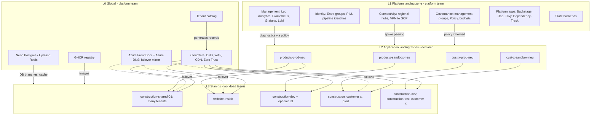
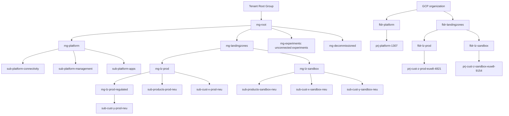
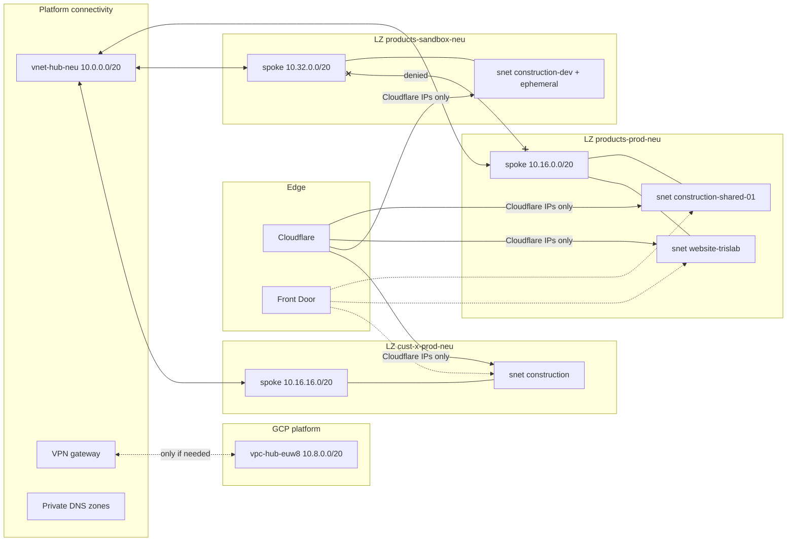
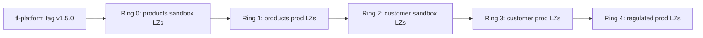
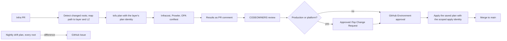
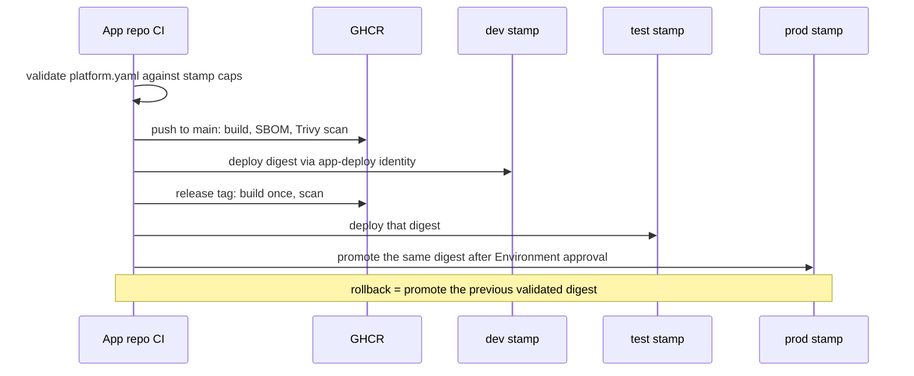

# 02 — Architecture

> Part of [spec v2](./README.md). Satisfies the requirements in [`01-requirements.md`](./01-requirements.md); see [section 10](#10-requirement-coverage) for the mapping.

## 1. Layer model

The platform has four layers. Each layer has one owner, its own automation identity, its own state and its own change cadence. A layer only consumes the layer below it and never modifies it.

| Layer | Purpose | Owner | How many | Change rate | Applied by |
|---|---|---|---|---|---|
| **L0 Global** | Edge (DNS, WAF, CDN, Zero Trust), container registry, external SaaS accounts, tenant catalog | Platform team | 1 | Low | `spn-global-apply` |
| **L1 Platform landing zone** | Management hierarchy, policy, identity, connectivity hub, management (logs, metrics), state backends, platform apps | Platform team | 1 per cloud | Rare | `spn-platform-apply` |
| **L2 Application landing zones** | Subscription (Azure) or project (GCP) created from a declaration, with spoke network, Key Vault, budget, RBAC, diagnostics and a deploy identity | Platform team (via the `landing-zone` module) | Few: owner × environment type | Rare | `spn-landingzones-apply` |
| **L3 Stamps** | One instance of a versioned workload template: compute environment, apps, data, hostname bindings, app identities | Workload teams | Many | Often | the owning LZ's `spn-lz-<lz>-deploy` |

### Rules

1. **A stamp is only parameters.** A stamp instance is a `stamp.yaml` plus a generated ~10-line `main.tf` that pins `tl-platform//stamps/<template>?ref=vX.Y.Z`. There is never hand-written workload infrastructure per customer or per product.
2. **Tenancy is a parameter, not a code path.** A shared product stamp lists many tenants; a dedicated customer stamp lists one. Both come from the same template (F3).
3. **A stamp lives in exactly one application landing zone.** It can only be applied with that landing zone's deploy identity, so it cannot touch the platform or any other landing zone (N3).
4. **Landing zones are created from declarations.** Each landing zone is one `lz.yaml` processed by the `landing-zone` module. New customers, graduations and new owners all mean "add a file" (N12).
5. **The tenant catalog is the source of truth** for tenant → stamp → landing zone → region → hostnames. Edge DNS and routing are generated from it. The developer portal later writes to it through PRs.
6. **Every name follows [`03-naming-conventions.md`](./03-naming-conventions.md).** Every environment is of type `prod` or `sandbox` ([ADR 0004](./adr/0004-environment-types-prod-and-sandbox.md)).



## 2. Governance hierarchy

Management groups are organised by **policy archetype** (production, sandbox, regulated), not by owner. Ownership is expressed through the subscription itself, tags, budgets and RBAC. This keeps the hierarchy small and stable as customers are added: a new customer adds subscriptions, never management groups. GCP mirrors the same shape with folders and projects.



### Policy assignment by scope

| Scope | Policies |
|---|---|
| `mg-root` | EU regions only; mandatory tags (deny); diagnostics to the central workspace (DeployIfNotExists); deny public blob access; require TLS 1.2+ |
| `mg-platform` | Platform-only resource types allowed; no workload SKUs |
| `mg-lz-prod` | Stricter SKU allow-list; backup required on stateful services; deny Backstage identity |
| `mg-lz-prod-regulated` | Advanced audit logging; customer-managed keys required; route diagnostics to the landing zone's dedicated workspace |
| `mg-lz-sandbox` | Cost caps (SKU deny-list); scale-to-zero defaults; Zero Trust-only ingress |
| `mg-experiments` | No peering to hubs; short-lived resources; hard budget |
| `mg-decommissioned` | Deny all writes (holding area before cancellation, see [Decommissioning](#decommissioning)) |

GCP applies the equivalent Organization Policies at the matching folders (e.g. `gcp.resourceLocations` EU only, no external IPs on compute, CMEK on regulated folders).

### Collapse and growth

- **MVP collapse (N12):** the three platform subscriptions can start as a single `sub-platform`, placed in `mg-platform`. Splitting it later moves resources between subscriptions and does not change the hierarchy or repository layout.
- **One landing zone = one subscription per environment type and region** ([ADR 0015](./adr/0015-one-landing-zone-one-region.md)). Each owner (the products group, each customer, each graduated product) starts with a `-sandbox-neu` and a `-prod-neu` landing zone. A landing zone in another region is added only when a stamp has to run there. A second landing zone in the same region (`-<nn>`, e.g. `cust-x-prod-neu-02`) is added only when a landing zone setting (`archetype`, `budget`, `access`, Key Vault, `observability`) has to differ for some of the owner's stamps. Differences `stamp.yaml` can express stay in one landing zone. A customer's dev and test stamps share the sandbox landing zone; prod goes to the prod landing zone.

## 3. Creating landing zones

Every application landing zone is declared in one file and created by the `landing-zone` module from `tl-platform`. The module:

1. creates (or adopts) the subscription/project under the management group or folder that matches `archetype`, and bills it to its owner's invoice section (`is-platform`, `is-products` or `is-cust-<code>`), creating the section first if it doesn't exist yet ([ADR 0011](./adr/0011-one-invoice-with-a-section-per-owner.md));
2. creates the spoke VNet/VPC from the declared range, and **both halves** of the hub peering;
3. creates the landing zone's Key Vault / Secret Manager (CMK-backed when regulated);
4. creates the budget, wired to the shared FinOps action group plus any extra recipients;
5. creates the landing zone's deploy identity `spn-lz-<lz>-deploy` with a federated credential for the GitHub Environment `lz-<lz>`, and gives it Contributor on this subscription only, plus the limited rights stamps need to grant their own roles and write their secrets ([ADR 0024](./adr/0024-deploy-identity-grants-stamp-roles.md));
6. grants the human and guest RBAC declared in `access` (PIM-eligible for Trislab groups, B2B guest groups for customer admins);
7. creates a dedicated Log Analytics workspace when `observability.dedicated_workspace` is set.

```yaml
# landing-zones/cust-x-prod-neu.yaml
name: cust-x-prod-neu
state: active                   # active | decommissioned | cancelled
cloud: azure
archetype: prod                 # prod | prod-regulated | sandbox
owner: { customer: x }
subscription: sub-cust-x-prod-neu
region: northeurope            # fixed for good; matches the region code in name (before any -<nn>)
network:
  spoke_cidr: 10.16.16.0/20     # from catalog/ipam.yaml
budget:
  monthly_eur: 300
  extra_recipients: [it@customer-x.example]
access:
  - group: grp-devops           # PIM-eligible Contributor
    role: Contributor
    pim: true
  - group: grp-cust-x-admins    # B2B guests
    role: Reader
observability:
  dedicated_workspace: false
```

The invoice section is not declared. It follows from `owner`: a customer's landing zones go to `is-cust-<code>`, the shared products and every graduated product go to `is-products`.

### Decommissioning

A landing zone retires in five steps. Nothing is cancelled by accident: the `landingzones` layer sets `prevent_cancellation_on_destroy`, so only step 4 cancels a subscription.

| # | Step | What happens |
|---|---|---|
| 1 | **Remove stamps** | PRs delete `stamps/<lz>/*`. Each stamp is destroyed with the landing zone's own deploy identity. |
| 2 | **Decommission** | A PR sets `state: decommissioned`, `decommissioned_on: <date>` and optionally `hold_days: <n>` (default 30). The module removes both halves of the hub peering, deletes the landing zone's plan and deploy identities and its GitHub Environment `lz-<lz>`, removes the `access` grants, and moves the subscription to `mg-decommissioned`, where all writes are denied. Data stays, costs keep running and the budget stays. |
| 3 | **Hold** | For `hold_days`, platform admins can still read and export data through PIM. A PR back to `state: active` undoes the decommissioning. |
| 4 | **Cancel** | When `decommissioned_on + hold_days` has passed, a scheduled job opens a PR setting `state: cancelled`. It is approved like any `landingzones` apply; prod landing zones also need an iTop Change Request. The apply cancels the subscription. Azure keeps it disabled for about 90 days, then deletes it. |
| 5 | **Clean up** | The spoke range returns to `catalog/ipam.yaml`. After Azure has deleted the subscription, a PR removes the `lz.yaml`. The invoice section stays, because old invoices refer to it, and the owner code is never reused ([03 section 4](./03-naming-conventions.md#4-owner-codes)). |

## 4. Network



- **Hub and spoke per region.** Each region has one hub in platform connectivity (VPN gateway, private DNS zones, and later shared egress if static outbound IPs are needed). Every application landing zone is in exactly one region and has one spoke, peered only to that region's hub ([ADR 0015](./adr/0015-one-landing-zone-one-region.md)).
- **IP plan** (`catalog/ipam.yaml`): hubs take a /20 per region from `10.0.0.0/12` (GCP hubs from `10.8.0.0/13`); each production landing zone takes a /20 from `10.16.0.0/12`; each sandbox landing zone from `10.32.0.0/12`. The stamp template takes its own subnet from its landing zone's spoke, sized for the compute type (e.g. /27 for Consumption-only Container Apps, /23 for AKS).
- **Isolation (N4).** There is no spoke-to-spoke transit through the hub. NSG rules deny all sandbox ↔ production traffic, without Azure Virtual Network Manager. The stamp templates write them into every stamp's NSG, because every subnet belongs to a stamp ([ADR 0025](./adr/0025-stamp-nsg-carries-isolation-rules.md)). Each stamp subnet's NSG denies traffic from other stamp subnets by default.
- **Ingress.** Public stamp ingress accepts only Cloudflare's published IP ranges plus the Front Door service tag. Sandbox hostnames are additionally behind Cloudflare Zero Trust through a wildcard access policy, so new environments are locked down automatically (N7).
- **Cross-cloud.** Hub-to-hub VPN (Azure VPN Gateway ↔ GCP Cloud VPN) is deployed only when a stamp actually needs private cross-cloud traffic. GCP-only customers use only GCP-side resources (F5).

## 5. Stamps

### Template catalogue

Templates are versioned modules in `tl-platform`, released as git tags. The template contract, the `stamp.yaml` schema and `aca-app` are specified in [`06-stamp-templates.md`](./06-stamp-templates.md).

| Template | Compute | Typical use |
|---|---|---|
| `stamps/aca-app` | Container Apps environment (Consumption and/or Dedicated workload profiles) + 1..n apps | SaaS products, websites, SPAs |
| `stamps/aks-app` | AKS cluster + ingress controller + Helm releases | ERP / complex microservice systems |
| `stamps/functions-app` | Azure Functions / GCP Cloud Functions | Event-driven processing, report generation |
| `stamps/cloudrun-app` | Cloud Run services with sidecars | GCP-only customers |

Every template is built from shared building blocks (`db-neon`, `db-postgres`, `cache-upstash`, `kv-secret-access`, `hostname-bindings`, `app-deploy-identity`, `stamp-network`) and **always** provides:

- its own subnet and NSG inside the landing zone spoke;
- a workload managed identity with **per-secret** RBAC on the landing zone's Key Vault;
- an **app-deploy identity**, federated to the app repository's GitHub Environments and scoped to this stamp's apps only, able to change image and sizing and nothing else;
- a binding for every hostname the catalog maps to this stamp, once `global/edge` has written its DNS records in Cloudflare and Azure DNS ([ADR 0027](./adr/0027-global-edge-writes-stamp-dns-records.md));
- diagnostics to the landing zone's workspace, with the mandatory tags applied to every resource;
- the sizing caps that `platform.yaml` is validated against, exported as outputs;
- `ignore_changes` on image and sizing, so app deploys never cause drift.

### Stamp instance

```yaml
# stamps/cust-x-prod-neu/construction/stamp.yaml
template: aca-app
version: v1.4.0              # bumped per instance, ring by ring
lz: cust-x-prod-neu          # the stamp runs in this landing zone's region
tenancy: dedicated           # shared | dedicated
zone_redundant: false        # true: spread over availability zones (ADR 0017)
environment: prod            # EnvironmentName: dev | test | uat | perf | demo | staging | pr<n> | prod
apps:
  - name: web
    profile: Consumption
  - name: api
    profile: Dedicated-D4
data:
  postgres: { provider: neon }
  cache: { provider: upstash }
```

`zone_redundant: true` turns on availability zones for every service in the stamp whose OpenTofu provider supports them, Azure or not. External services whose provider doesn't support zones, such as Neon and Upstash today, stay as they are until it does. The setting covers the whole stamp, so on a shared stamp such as `construction-shared-01` it applies to every tenant ([ADR 0017](./adr/0017-availability-zones-per-stamp.md)).

```hcl
# stamps/cust-x-prod-neu/construction/main.tf  (generated, never hand-edited)
module "stamp" {
  source = "git::https://github.com/<org>/tl-platform.git//stamps/aca-app?ref=v1.4.0"
  config = yamldecode(file("${path.module}/stamp.yaml"))
  tenants = [for t in yamldecode(file("${path.root}/../../../catalog/tenants.yaml")).tenants : t
             if t.stamp == "cust-x-prod-neu/construction"]
}
```

A CI check fails if `main.tf` differs from what the generator would produce from `stamp.yaml`, or if the `ref` doesn't match `version`.

### Rollout rings

A dependency bot (Renovate) opens one PR per ring whenever a template gets a new tag. A ring's PR opens only after the previous ring's PR has been applied:



### Ephemeral stamps

Sandbox dev, uat, perf and demo environments, and PR previews, are instances of the same templates with a `ttl:` field. They exist only in sandbox landing zones. The pipeline creates them and a scheduled job destroys them when the TTL expires. The same job opens the cancel PRs for decommissioned landing zones whose hold has passed ([section 3](#decommissioning)). The developer portal takes over their creation later (F10).

## 6. Identity and access

| Identity | Scope | Used by | Trust |
|---|---|---|---|
| `spn-global-plan` / `spn-platform-plan` / `spn-landingzones-plan` | Reader on the layer's scope; `spn-landingzones-plan` also Reader on each `vnet-hub-<code>` ([ADR 0018](./adr/0018-hub-peering-custom-role.md)) and on `rg-platform-dns` ([ADR 0020](./adr/0020-landing-zone-links-private-dns-zones.md)); `spn-global-plan` also "Edge stamp reader" on each landing zone subscription ([ADR 0027](./adr/0027-global-edge-writes-stamp-dns-records.md)) | PR plan jobs | OIDC, `pull_request` subject |
| `spn-lz-<lz>-plan` (created by `landing-zone`) | Reader on that landing zone; Key Vault Reader on its Key Vault (names, never values; [ADR 0024](./adr/0024-deploy-identity-grants-stamp-roles.md)) | Stamp PR plan jobs | OIDC, `pull_request` subject |
| `spn-global-apply` | Front Door / Azure DNS resource group; Cloudflare edit token (Environment secret); "Edge stamp reader" on each landing zone subscription ([ADR 0027](./adr/0027-global-edge-writes-stamp-dns-records.md)); writes the vendor secrets of the `lz-<lz>` Environments through the GitHub App `tl-global-apply`, without being able to read them ([ADR 0026](./adr/0026-vendor-credentials-through-lz-environment.md)) | L0 apply | GitHub Environment `global` |
| `spn-platform-apply` | Owner on `mg-platform`; Resource Policy Contributor on `mg-root` | L1 apply | GitHub Environment `platform` |
| `spn-landingzones-apply` | Billing profile contributor on "Trislab billing profile" ([ADR 0011](./adr/0011-one-invoice-with-a-section-per-owner.md)); Management Group Contributor on `mg-landingzones` and `mg-decommissioned`; User Access Administrator **with a condition** that only allows assigning the fixed set of landing zone roles: Reader, Contributor, Key Vault Reader, Key Vault Secrets Officer, Role Based Access Control Administrator ([ADR 0024](./adr/0024-deploy-identity-grants-stamp-roles.md)) and "Edge stamp reader" ([ADR 0027](./adr/0027-global-edge-writes-stamp-dns-records.md)); the custom role "Landing zone hub peering" on each `vnet-hub-<code>`, granted by `platform/azure/connectivity` ([ADR 0018](./adr/0018-hub-peering-custom-role.md)); the custom role "Landing zone DNS link" on `rg-platform-dns`, granted by the same root ([ADR 0020](./adr/0020-landing-zone-links-private-dns-zones.md)); manages the `lz-<lz>` GitHub Environments through the GitHub App `tl-landingzones-apply` ([ADR 0019](./adr/0019-github-app-for-landing-zone-environments.md)) | L2 apply | GitHub Environment `landingzones` |
| `spn-lz-<lz>-deploy` (created by `landing-zone`) | Contributor on that landing zone's subscription only; Role Based Access Control Administrator on it, with a condition that allows assigning only Key Vault Secrets User and "Stamp app deploy" to service principals; Key Vault Secrets Officer on its Key Vault ([ADR 0024](./adr/0024-deploy-identity-grants-stamp-roles.md)) | L3 stamp apply | GitHub Environment `lz-<lz>` |
| `id-<stamp>-appdeploy` (created by the stamp) | The custom role "Stamp app deploy" on that stamp's apps only ([ADR 0024](./adr/0024-deploy-identity-grants-stamp-roles.md)) | App repo CI | The app repo's GitHub Environments |
| `id-backstage` | Contributor on sandbox landing zones only; denied at `mg-lz-prod` | Developer portal | Managed identity |
| Trislab engineers | Entra groups, PIM-eligible, MFA | — | PIM |
| Customer IT admins | B2B guest groups, limited roles on their own landing zones only | — | MFA |

GCP uses the same split: one service account per identity row, with WIF pools bound to the same GitHub repository and Environment subjects.

### Secrets

| Store | Holds | Who reads |
|---|---|---|
| Platform Key Vault (`sub-platform-management`) | Platform system secrets, break-glass credentials | Platform apps, break-glass procedure |
| Landing zone Key Vault / Secret Manager (one per landing zone) | Owner's app-runtime secrets; CMK for regulated landing zones | Stamp workload identities, per secret |
| GitHub Environment secrets | Only credentials that cannot be federated (Cloudflare, SaaS API keys), split plan/apply. Each `lz-<lz>` holds the vendor credentials handed to its stamps (Neon, Upstash, GHCR pull), written by `global` and the `landing-zone` module ([ADR 0026](./adr/0026-vendor-credentials-through-lz-environment.md)) | The matching pipeline job; `lz-<lz>` secrets only in stamp applies, which copy them into the landing zone Key Vault |
| GitHub App keys | `tl-landingzones-apply` private key as an Environment secret of `landingzones`; `tl-landingzones-plan` (read-only) private key as a repository secret ([ADR 0019](./adr/0019-github-app-for-landing-zone-environments.md)); `tl-global-apply` private key as an Environment secret of `global` ([ADR 0026](./adr/0026-vendor-credentials-through-lz-environment.md)). Rotated by hand | `landingzones` apply; landing zone PR plans; `global` apply |

## 7. Repositories and layout

| Repository | Contents | Owner |
|---|---|---|
| `tl-cloud-infrastructure` | All L0–L3 declarations and root modules (layout below) | Platform team; `stamps/` co-owned with workload teams through CODEOWNERS |
| `tl-platform` | Versioned modules: `landing-zone`, `stamps/*`, building blocks | Platform team |
| `tl-template-*` | App templates: Dockerfile, CI, `platform.yaml` schema, promotion gate | Platform team |
| App repositories | Source code, `platform.yaml`, build-once/promote CI | Workload teams |
| `tl-platform-backstage` | Portal templates that open PRs adding `stamp.yaml`, `lz.yaml` and catalog entries | Platform team |

```text
tl-cloud-infrastructure/
├── global/                          # L0 -> Environment "global"
│   ├── edge/                        #   Cloudflare zones, WAF, Zero Trust; Azure DNS + Front Door mirror
│   ├── registry/                    #   GHCR organisation settings
│   └── external-providers/          #   Neon, Upstash accounts and projects
├── platform/                        # L1 -> Environment "platform"; one root per folder
│   ├── azure/
│   │   ├── governance/              #   management groups, policy, FinOps action group
│   │   ├── identity/                #   Entra groups, pipeline identities, PIM
│   │   ├── connectivity/            #   hubs per region, VPN, private DNS
│   │   ├── management/              #   Log Analytics, alerts, platform Key Vault
│   │   └── state/                   #   state backends
│   ├── gcp/                         #   same five roots, GCP-side
│   └── apps/
│       ├── backstage/{staging,prod}/
│       ├── itop/{staging,prod}/
│       ├── security/                #   Trivy, Dependency-Track
│       └── observability/           #   Prometheus, Grafana, Loki
├── landing-zones/                   # L2 -> Environment "landingzones"
│   ├── _root/                       #   one root; state key = landing zone name
│   ├── products-sandbox-neu.yaml
│   ├── products-prod-neu.yaml
│   ├── cust-x-sandbox-neu.yaml
│   └── cust-x-prod-neu.yaml
├── stamps/                          # L3 -> Environment "lz-<lz>"
│   ├── products-sandbox-neu/
│   │   └── construction-dev/{stamp.yaml,main.tf}
│   ├── products-prod-neu/
│   │   ├── construction-shared-01/{stamp.yaml,main.tf}
│   │   └── website-trislab/{stamp.yaml,main.tf}
│   ├── cust-x-sandbox-neu/
│   │   ├── construction-dev/{stamp.yaml,main.tf}
│   │   └── construction-test/{stamp.yaml,main.tf}
│   └── cust-x-prod-neu/
│       └── construction/{stamp.yaml,main.tf}
├── catalog/
│   ├── tenants.yaml                 # tenant -> stamp, hostnames, customer domain
│   └── ipam.yaml                    # address ranges per hub and landing zone
└── policy/                          # OPA/conftest rules run on every plan
```

The full tree, with every product, customer and environment, is in [`04-repository-structure.md`](./04-repository-structure.md).

**The path decides the identity.** The pipeline maps each changed root to its layer and requests credentials only for that layer: `platform/**` can only get platform credentials, and `stamps/<lz>/**` only that landing zone's deploy identity. Each GitHub Environment's federated credential trusts only its own Environment name, so layer separation is enforced by the cloud, not only by review.

## 8. Delivery flows

### Infrastructure change



The saved plan is applied before merge, so `main` always reflects what is live. For production and platform roots, the pipeline opens the iTop Change Request automatically at plan time, linked to the PR, and checks that it is approved before applying.

### Application change



| Change | Where |
|---|---|
| Code, or sizing within caps | App repo only |
| New environment, domain, sizing caps, data service, app added to a stamp | `tl-cloud-infrastructure` PR (`stamp.yaml` / catalog) |
| New customer or graduation | `tl-cloud-infrastructure` PRs (`lz.yaml`, then stamps) |
| Template behaviour | `tl-platform` release, then ring PRs |

## 9. Cross-cutting concerns

- **Observability.** Log Analytics (platform resources, activity logs) and Prometheus, Grafana and Loki (apps) run centrally in platform management. Landing zone policy wires diagnostics automatically, and the mandatory tags plus the [naming grammar](./03-naming-conventions.md) make tenant, product and environment filtering work with no extra setup. Regulated landing zones get their own workspace from the `landing-zone` module. Default retention is 14 days. Alerts go to Slack.
- **FinOps.** Trislab receives one Azure invoice, divided into invoice sections: `is-platform`, `is-products` and one `is-cust-<code>` per customer, each listing its subscriptions. Trislab re-charges customers from these subtotals with its own tools ([ADR 0011](./adr/0011-one-invoice-with-a-section-per-owner.md)). The `landing-zone` module creates a budget per landing zone subscription. Tags are enforced twice: by Azure Policy (deny) and by OPA at plan time. Cost per product within the shared products landing zones comes from tag-filtered cost views. Infracost shows the cost delta on every PR.
- **State.** Each layer has its own backend container (`tfstate-global`, `tfstate-platform`, `tfstate-lz`, `tfstate-stamps`), and each root, landing zone and stamp has its own key, named after the root with no cloud token (e.g. `governance.tfstate`, `cust-oc-prod-neu.tfstate`; [03 section 7.2](./03-naming-conventions.md#72-l1-platform-landing-zone)). Versioning, soft delete and locking are on. A nightly job copies Azure state to GCS and GCP state to Azure Blob.
- **Regions.** A landing zone is in one region, and a stamp runs in its landing zone's region ([ADR 0015](./adr/0015-one-landing-zone-one-region.md)). A new region is added only when a product needs it: a new hub root in `platform/*/connectivity`, then a landing zone in that region for each owner that needs one, then new stamp instances ([ADR 0016](./adr/0016-regions-added-when-needed.md)). Moving a stamp between regions means creating it in the other region's landing zone and switching DNS. Stateful services follow their provider's restore or replication path. Within a region, a stamp can spread over availability zones with `zone_redundant` ([ADR 0017](./adr/0017-availability-zones-per-stamp.md)).
- **Edge resilience.** The catalog publishes every hostname to both Cloudflare and Azure DNS (both sets of nameservers are listed at the registrar). Front Door mirrors the origins of production stamps and takes over if Cloudflare is unavailable.
- **Supply chain.** App CI pushes to GHCR and scans with Trivy before deploying. SBOMs go to Dependency-Track, and results appear in the developer portal per product and customer.

## 10. Requirement coverage

| Requirement | Satisfied by |
|---|---|
| F1 Trislab products | Products landing zones (sections 2 and 3); shared stamps (section 5) |
| F2 Customer deployments | Per-customer landing zones (section 3); dedicated stamps (section 5) |
| F3 Shared or dedicated from same code | Rule 2 (section 1); `tenancy` parameter (section 5) |
| F4 Archetypes and data | Template catalogue and building blocks (section 5) |
| F5 Multi-cloud, GCP-only isolation | GCP folders and projects (section 2); `cloudrun-app` (section 5); optional VPN (section 4) |
| F6 Environments | Environment-type landing zones (section 2); `environment` field and ephemeral stamps (section 5) |
| F7 Build once, promote | Application change flow (section 8) |
| F8 Customer domains | Catalog-driven DNS (sections 1 and 5); `global/edge` (section 7) |
| F9 Developers don't create infra | App-deploy identity, caps, `ignore_changes` (sections 5 and 8) |
| F10 Self-service sandbox only | `id-backstage` scope (section 6); portal opens PRs (section 7) |
| F11 Graduation without app change | New `lz.yaml` + move stamp (section 11) |
| F12 Customer admins, regulated customers | `lz.yaml` `access` (section 3); `prod-regulated` archetype (section 2); CMK, dedicated workspace (sections 3 and 9) |
| F13 Platform apps | `platform/apps` (section 7) |
| N1 PR pipeline with gates | Infrastructure change flow (section 8) |
| N2 No long-lived secrets | Identity table and secrets (section 6) |
| N3 Least privilege | Per-layer and per-landing-zone identities; path → identity (sections 6 and 7) |
| N4 Isolation | Subscription per owner × env class (section 2); network isolation (section 4); per-LZ vaults (section 6) |
| N5 FinOps | Landing zone budgets; invoice section per owner; tag enforcement (sections 3 and 9) |
| N6 EU regions, region switch | `mg-root` policy (section 2); regions (section 9); [ADR 0016](./adr/0016-regions-added-when-needed.md) |
| N7 Edge without SPOF | Dual DNS, Front Door mirror, Zero Trust (sections 4 and 9) |
| N8 Central observability | Section 9 |
| N9 Supply chain | Section 9 |
| N10 State | Section 9 |
| N11 Manual only for seed | Section 12 |
| N12 Grow by adding instances | Rules 1 and 4 (section 1); collapse and growth (section 2) |

## 11. Key scenarios

**Onboard a new customer.**
1. PR adding `landing-zones/cust-c-sandbox-neu.yaml`, `cust-c-prod-neu.yaml`, the customer's zone in `global/edge`, and ranges in `catalog/ipam.yaml`. Applied through the `landingzones` and `global` Environments. The first apply also creates the customer's invoice section `is-cust-c`.
2. The customer's IT delegates the NS records at their registrar (the only manual step).
3. PR adding `stamps/cust-c-sandbox-neu/<product>-dev/stamp.yaml` (and `-test`, then `stamps/cust-c-prod-neu/<product>/`) plus catalog hostnames. Each stamp is applied with its landing zone's identity.
4. The app repo gets the app-deploy identity's client ID as GitHub Environment variables. Deploys start.

**Graduate a product.**
1. PR adding `landing-zones/prdt-p-sandbox-neu.yaml` and `prdt-p-prod-neu.yaml` (optionally in a child management group if it needs its own policy).
2. PR adding new stamp instances in the new landing zones, same template and parameters. Stateless apps come up empty; data is migrated per service (Neon branches move with the project; managed PostgreSQL is restored into the new stamp).
3. Catalog hostnames are re-pointed to the new stamp, DNS cuts over, and the old stamp is removed.
4. The app repo's Environment variables are updated to the new app-deploy identity by the platform team. The app code and `platform.yaml` stay the same.

**Offboard a customer.**
1. PRs removing the customer's stamps from `stamps/cust-c-sandbox-neu/` and `stamps/cust-c-prod-neu/`, and their hostnames from the catalog.
2. PR setting `state: decommissioned` and `decommissioned_on` (and `hold_days` if the contract needs a longer data-return period) in each of the customer's `lz.yaml` files, and removing the customer's zone from `global/edge`.
3. During the hold, platform admins hand over any data the contract requires.
4. The scheduled job opens the cancel PR when the hold ends. After approval, the subscriptions are cancelled. Details in [section 3](#decommissioning).

**Roll out a template change.**
1. A `tl-platform` PR changes `stamps/aca-app` and is tagged `v1.5.0`.
2. Renovate opens the ring-0 PR bumping `version` in all stamps of the products sandbox landing zones (`products-sandbox-neu`). It is planned, reviewed and applied.
3. Rings 1–4 follow. Any failure stops the rollout at that ring with the remaining stamps untouched.

## 12. Bootstrap (manual seed)

Only these steps are manual (N11). They are done once by a PIM-activated tenant owner / GCP org admin, in a tenant that holds none of the platform's resources ([ADR 0028](./adr/0028-platform-built-in-empty-tenant.md)). The runbook, with every command, is [`09-bootstrap.md`](./09-bootstrap.md):

1. Create `mg-root` and `mg-platform`, and the first platform subscription `sub-platform` in the invoice section `is-platform`.
2. Create the state backend storage (Azure Blob; GCS bucket for GCP).
3. Create `spn-platform-plan` and `spn-platform-apply` with their federated credentials and role assignments; on GCP, the WIF pool and platform service accounts.
4. Create the Cloudflare account and the two scoped API tokens (plan read-only, apply edit).
5. A GitHub organization owner creates the GitHub Apps `tl-landingzones-apply`, `tl-landingzones-plan` and `tl-global-apply`, installs them only on `tl-cloud-infrastructure`, and stores their keys ([ADR 0019](./adr/0019-github-app-for-landing-zone-environments.md), [ADR 0026](./adr/0026-vendor-credentials-through-lz-environment.md)).

From there, `platform/azure/identity` adopts the seed identities into code and creates every other identity. `platform/azure/governance` builds the rest of the hierarchy.

One more manual step follows, once `platform/azure/identity` has created `spn-landingzones-apply`: a billing account owner grants it **Billing profile contributor** on "Trislab billing profile", through the billing REST API ([ADR 0011](./adr/0011-one-invoice-with-a-section-per-owner.md)). This is a standing assignment, made once, not before every apply. From then on, the `landing-zone` module takes over for landing zones.

## 13. Decisions and open questions

**Decisions** are recorded as ADRs in [`adr/`](./adr/README.md). The ones this document relies on:

1. [ADR 0005](./adr/0005-management-groups-by-archetype.md): management groups by archetype (prod / sandbox / regulated), with **no per-customer management group**.
2. [ADR 0006](./adr/0006-monorepo-with-path-based-identity.md): one infrastructure monorepo with **path-based identity separation**.
3. [ADR 0007](./adr/0007-customer-dev-and-test-share-sandbox-lz.md): a customer's dev and test share one sandbox landing zone.
4. [ADR 0008](./adr/0008-gcp-built-on-first-customer.md): GCP follows the same model but is built only for the first GCP-only customer.
5. [ADR 0009](./adr/0009-ring-based-template-rollout.md): stamp instances pin template versions; changes roll out ring by ring.
6. [ADR 0010](./adr/0010-top-management-group-mg-root.md): the top management group is `mg-root`.
7. [ADR 0011](./adr/0011-one-invoice-with-a-section-per-owner.md): one Azure invoice with an invoice section per customer, plus `is-platform` and `is-products`; `spn-landingzones-apply` creates the sections.
8. [ADR 0012](./adr/0012-tenant-catalog-stays-yaml.md): the tenant catalog stays a YAML file in the repository; the portal changes it only through PRs.
9. [ADR 0013](./adr/0013-nsg-rules-without-network-manager.md): NSG rules separate sandbox from production; Azure Virtual Network Manager is not used. Superseded by ADR 0025, which keeps both and moves the rules into the stamps' NSGs.
10. [ADR 0014](./adr/0014-gcp-region-europe-west8.md): the first GCP region is `europe-west8` (Milan).
11. [ADR 0015](./adr/0015-one-landing-zone-one-region.md): a landing zone is in exactly one region, and its name carries the region code; a second landing zone in the same region gets `-<nn>` and exists only when a landing zone setting has to differ.
12. [ADR 0016](./adr/0016-regions-added-when-needed.md): a region is added only when a product needs it, and is fully set up first.
13. [ADR 0017](./adr/0017-availability-zones-per-stamp.md): availability zones are off by default and turned on per stamp with `zone_redundant`.
14. [ADR 0018](./adr/0018-hub-peering-custom-role.md): `spn-landingzones-apply` gets a custom role on each hub VNet that only allows reading the hub and managing its peerings, so a landing zone creates both halves of its peering itself.
15. [ADR 0019](./adr/0019-github-app-for-landing-zone-environments.md): the GitHub App `tl-landingzones-apply` lets the `landing-zone` module create and delete each landing zone's GitHub Environment, with its reviewers in place before the deploy identity trusts it.
16. [ADR 0020](./adr/0020-landing-zone-links-private-dns-zones.md): the `landing-zone` module links every `privatelink.*` zone in `rg-platform-dns` to its own spoke, with a custom role that only allows managing the zones' virtual network links.
17. [ADR 0021](./adr/0021-region-order-checked-against-live-state.md): each region PR checks at plan time that the step before it is live in the cloud, so the order governance → connectivity → landing zones → stamps is enforced without pipeline logic.
18. [ADR 0022](./adr/0022-landing-zone-resource-groups-per-purpose.md): a landing zone has `rg-<lz>-network`, `rg-<lz>-security` and, when regulated, `rg-<lz>-monitoring`; the security and monitoring groups have a delete lock the stamps' deploy identity can't remove.
19. [ADR 0024](./adr/0024-deploy-identity-grants-stamp-roles.md): a landing zone's deploy identity may assign only Key Vault Secrets User and "Stamp app deploy", and writes secrets into its landing zone's Key Vault.
20. [ADR 0025](./adr/0025-stamp-nsg-carries-isolation-rules.md): every stamp's NSG carries the sandbox/production deny rules, written by the stamp template.
21. [ADR 0026](./adr/0026-vendor-credentials-through-lz-environment.md): vendor credentials (Neon, Upstash, GHCR pull) reach a stamp through its landing zone's GitHub Environment, and only the stamp writes them into the Key Vault.
22. [ADR 0027](./adr/0027-global-edge-writes-stamp-dns-records.md): `global/edge` writes every stamp's DNS records, looking up its address by name; the stamp only binds its hostnames once the records exist.
23. [ADR 0028](./adr/0028-platform-built-in-empty-tenant.md): the platform is built in an empty tenant; existing resources are removed, not adopted.
24. [ADR 0029](./adr/0029-environment-approval-gate-until-itop.md): the GitHub Environment approval is the only apply gate until iTop runs in production.

**Open questions** are tracked in [`TODO.md`](./TODO.md#open-questions).
