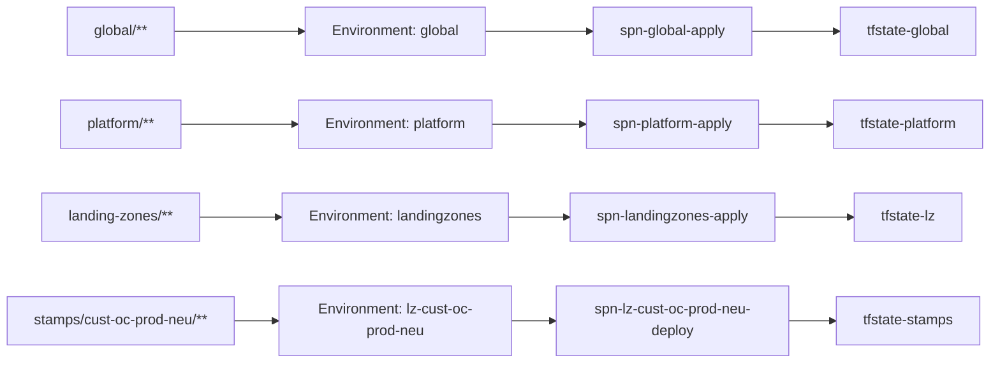

# 04 — Repository structure

> Part of [spec v2](./README.md). Expands the layout in [02 section 7](./02-architecture.md#7-repositories-and-layout) into the full `tl-cloud-infrastructure` tree, with every Trislab product and every current customer, their products and their environments. All names follow [`03-naming-conventions.md`](./03-naming-conventions.md).

## 1. How to read the tree

- **One folder with `.tf` files is one OpenTofu root.** It has its own state key and is planned and applied on its own. Every root also has `providers.tf`, `backend.tf` and `variables.tf`; the tree lists only the files that hold resources.
- **One stamp is one folder** under `stamps/<lz>/`, holding a `stamp.yaml` and a generated `main.tf` that pins a template version ([02 section 5](./02-architecture.md#5-stamps)). Nobody edits a stamp's `main.tf` by hand.
- **One landing zone is one file** under `landing-zones/`. The single root in `landing-zones/_root/` reads all of them, with one state key per landing zone ([02 section 3](./02-architecture.md#3-creating-landing-zones)).
- **Folder names use full slugs** (`construction`, `okna-capris`). **Resource names use codes** ([03 section 4](./03-naming-conventions.md#4-owner-codes), [03 section 7.4](./03-naming-conventions.md#74-l3-stamps)). Each stamp in the tree shows its stamp code in brackets.
- **Modules are not in this repository.** The `landing-zone` module, the stamp templates and the building blocks live in `tl-platform` and are referenced by version tag.
- A graduated product would add `landing-zones/prdt-<code>-sandbox-neu.yaml`, `prdt-<code>-prod-neu.yaml` and matching `stamps/prdt-<code>-*/` folders. No product has graduated yet, so none is shown.

## 2. Top level

| Folder | Layer | GitHub Environment | Apply identity | State container |
|---|---|---|---|---|
| `global/` | L0 Global | `global` | `spn-global-apply` | `tfstate-global` |
| `platform/` | L1 Platform landing zone | `platform` | `spn-platform-apply` | `tfstate-platform` (GCP roots: `gcs-platform-tfstate-1307`) |
| `landing-zones/` | L2 Application landing zones | `landingzones` | `spn-landingzones-apply` | `tfstate-lz` |
| `stamps/<lz>/` | L3 Stamps | `lz-<lz>` | `spn-lz-<lz>-deploy` | `tfstate-stamps` |
| `catalog/` | Data, read by L0 and L3 | — | — | — |
| `policy/` | OPA/conftest rules, run on every plan | — | — | — |
| `.github/` | Pipeline | — | — | — |

## 3. Full tree

```text
tl-cloud-infrastructure/
│
├── .github/
│   ├── CODEOWNERS                           # Platform team owns everything; workload teams co-own
│   │                                        # their stamp folders under stamps/.
│   └── workflows/
│       ├── tofu-plan.yml                    # On every PR: finds changed roots, maps each path to its
│       │                                    # layer and landing zone, plans with that layer's plan
│       │                                    # identity, runs Infracost, Prowler and OPA conftest, and
│       │                                    # posts the results as a PR comment. For production and
│       │                                    # platform roots it opens the iTop Change Request.
│       ├── tofu-apply.yml                   # Applies the saved plan before merge, inside the matching
│       │                                    # GitHub Environment (global, platform, landingzones,
│       │                                    # lz-<lz>). Production and platform roots also need an
│       │                                    # approved iTop Change Request.
│       ├── tofu-drift.yml                   # Nightly plan of every root; any difference opens a
│       │                                    # GitHub Issue.
│       ├── prowler-iac-scan.yml             # Security scan of the OpenTofu code on every PR.
│       ├── stamp-check.yml                  # Fails if a stamp's main.tf differs from what the generator
│       │                                    # produces from stamp.yaml, or if its ref doesn't match
│       │                                    # version.
│       └── scheduled-cleanup.yml            # Destroys ephemeral stamps whose ttl has expired, and opens
│                                            # the cancel PR for decommissioned landing zones whose hold
│                                            # has passed.
│
├── renovate.json                            # Template upgrades: one PR per rollout ring, each ring
│                                            # opened only after the previous one is applied.
│
├── global/                                  # L0 -> Environment "global"
│   ├── edge/
│   │   ├── zones.tf                         # Cloudflare zones and Azure DNS zones, one per Trislab and
│   │   │                                    # customer domain. Both nameserver sets are listed at the
│   │   │                                    # registrar, so DNS has no single point of failure.
│   │   ├── records.tf                       # DNS records in both providers, generated from
│   │   │                                    # catalog/tenants.yaml (hostname -> stamp): the hostname
│   │   │                                    # and its asuid record, pointing at the stamp's environment,
│   │   │                                    # looked up by name (ADR 0027). Stamps write no records.
│   │   ├── waf.tf                           # Cloudflare WAF and CDN rules.
│   │   ├── zero-trust.tf                    # Cloudflare Access wildcard policy on sandbox hostnames, so
│   │   │                                    # every new sandbox environment is locked down on creation.
│   │   └── front-door.tf                    # rg-global-edge, afd-global: Front Door mirror of the
│   │                                        # production stamp origins, takes over if Cloudflare fails.
│   ├── registry/
│   │   └── github.tf                        # GHCR organisation settings: the one image registry for
│   │                                        # every product and customer, in any cloud.
│   └── external-providers/
│       ├── neon.tf                          # Neon Postgres projects, one per stamp that uses Neon,
│       │                                    # named by stamp code (e.g. oc-con-prod), and a project-
│       │                                    # scoped key for each, written to the stamp's lz-<lz>
│       │                                    # Environment as NEON_KEY_<STAMP> (ADR 0026).
│       └── upstash.tf                       # Upstash Redis databases, one per stamp, pay per request;
│                                            # connection URL written to lz-<lz> as REDIS_URL_<STAMP>.
│
├── platform/                                # L1 -> Environment "platform"
│   ├── azure/
│   │   ├── governance/                      # state key: governance.tfstate
│   │   │   ├── management-groups.tf         # mg-root (display name "Trislab"), mg-platform,
│   │   │   │                                # mg-landingzones, mg-lz-prod, mg-lz-prod-regulated,
│   │   │   │                                # mg-lz-sandbox, mg-experiments, mg-decommissioned.
│   │   │   ├── policy.tf                    # Policy assignments per scope: EU regions only, mandatory
│   │   │   │                                # tags (deny), diagnostics to log-platform, SKU lists,
│   │   │   │                                # deny all writes in mg-decommissioned.
│   │   │   ├── custom-roles.tf              # "Stamp app deploy", assignable at mg-landingzones: read
│   │   │   │                                # and update container apps and revisions only (ADR 0024).
│   │   │   │                                # "Edge stamp reader": read Container Apps environments
│   │   │   │                                # only, for global/edge (ADR 0027).
│   │   │   └── finops.tf                    # ag-finops: the shared FinOps action group that every
│   │   │                                    # landing zone budget alerts through.
│   │   ├── identity/                        # state key: identity.tfstate
│   │   │   ├── groups.tf                    # grp-devops, grp-platform-admins, grp-regulated-admins;
│   │   │   │                                # PIM eligibility and MFA for Trislab engineers.
│   │   │   ├── pipeline-identities.tf       # spn-global-plan/-apply, spn-platform-plan/-apply
│   │   │   │                                # (adopted from the manual seed), spn-landingzones-plan/
│   │   │   │                                # -apply, each federated to its GitHub Environment.
│   │   │   └── backstage.tf                 # id-backstage: Contributor on sandbox landing zones only,
│   │   │                                    # denied at mg-lz-prod.
│   │   ├── connectivity/                    # state key: connectivity.tfstate
│   │   │   ├── hub-neu.tf                   # rg-hub-neu, vnet-hub-neu (10.0.0.0/20), GatewaySubnet.
│   │   │   ├── vpn.tf                       # vgw-hub-neu, pip-vgw-hub-neu, conn-hub-neu-to-gcp. Built
│   │   │   │                                # only when a stamp needs private cross-cloud traffic.
│   │   │   └── private-dns.tf               # rg-platform-dns: privatelink.* zones, linked to every
│   │   │                                    # hub; landing zones link their own spokes (ADR 0020).
│   │   ├── management/                      # state key: management.tfstate
│   │   │   ├── log-analytics.tf             # log-platform: central workspace, 14-day retention.
│   │   │   ├── key-vault.tf                 # kv-platform-1307: platform system secrets and break-glass
│   │   │   │                                # credentials.
│   │   │   └── alerts.tf                    # Platform alerts to Slack.
│   │   └── state/                           # state key: state.tfstate
│   │       ├── storage.tf                   # rg-platform-state, stplatformtfstate1307, containers
│   │       │                                # tfstate-global, tfstate-platform, tfstate-lz,
│   │       │                                # tfstate-stamps; versioning, soft delete, locking.
│   │       └── state-copy.tf                # Nightly copy of Azure state to GCS.
│   │
│   ├── gcp/                                 # Same five roots, built with the first GCP customer
│   │   │                                    # (Rehabo); state in gcs-platform-tfstate-1307.
│   │   ├── governance/
│   │   │   ├── folders.tf                   # fldr-platform, fldr-landingzones, fldr-lz-prod,
│   │   │   │                                # fldr-lz-sandbox; prj-platform-1307.
│   │   │   ├── org-policy.tf                # gcp.resourceLocations EU only, no external IPs on compute.
│   │   │   └── billing.tf                   # Billing export grouped by the customer label.
│   │   ├── identity/
│   │   │   └── workload-identity.tf         # wif-github pool; sa-platform-plan, sa-platform-apply,
│   │   │                                    # sa-landingzones-apply.
│   │   ├── connectivity/
│   │   │   ├── hub-euw8.tf                  # vpc-hub, snet-hub-euw8 (10.8.0.0/20).
│   │   │   └── vpn.tf                       # rtr-hub-euw8, vpngw-hub-euw8; the GCP end of
│   │   │                                    # conn-hub-neu-to-gcp, only when needed.
│   │   ├── management/
│   │   │   └── logging.tf                   # Log sinks to the central observability stack.
│   │   └── state/
│   │       ├── storage.tf                   # gcs-platform-tfstate-1307, versioned.
│   │       └── state-copy.tf                # Nightly copy of GCP state to Azure Blob.
│   │
│   └── apps/                                # Platform apps: serverless containers with scale to zero,
│       │                                    # reachable only through Cloudflare Zero Trust.
│       ├── backstage/                       # Developer portal; opens PRs that add stamp.yaml, lz.yaml
│       │   │                                # and catalog entries, never applies directly.
│       │   ├── staging/                     # Test portal for new portal templates.
│       │   │   ├── container.tf
│       │   │   └── database.tf              # Neon branch.
│       │   └── prod/
│       │       ├── container.tf
│       │       └── database.tf              # Neon project.
│       ├── itop/                            # ITSM: incidents, Change Requests that gate production
│       │   │                                # applies, SLA reporting.
│       │   ├── staging/
│       │   │   ├── container.tf
│       │   │   └── database.tf              # MySQL container with a persistent volume.
│       │   └── prod/
│       │       ├── container.tf
│       │       ├── database.tf
│       │       └── api-access.tf            # REST API tokens: one for the pipeline (create and read
│       │                                    # Change Requests), one per product and customer.
│       ├── security/
│       │   ├── trivy.tf                     # Image vulnerability scanning against GHCR.
│       │   └── dependency-track.tf          # SBOM analysis: licences and library vulnerabilities.
│       └── observability/
│           ├── prometheus.tf                # Metrics from every stamp.
│           ├── grafana.tf                   # Dashboards, filtered by the four mandatory tags.
│           └── loki.tf                      # Logs from both clouds, 14-day retention.
│
├── landing-zones/                           # L2 -> Environment "landingzones"
│   ├── _root/
│   │   └── main.tf                          # Calls tl-platform//landing-zone once per lz.yaml;
│   │                                        # state key = landing zone name (e.g. cust-oc-prod-neu.tfstate).
│   │
│   ├── products-sandbox-neu.yaml            # azure, archetype sandbox, sub-products-sandbox-neu,
│   │                                        # 10.32.0.0/20, invoice section is-products.
│   ├── products-prod-neu.yaml               # azure, archetype prod, sub-products-prod-neu,
│   │                                        # 10.16.0.0/20, invoice section is-products.
│   │
│   ├── cust-oc-sandbox-neu.yaml             # Okna Capris. azure, sandbox, sub-cust-oc-sandbox-neu,
│   │                                        # 10.32.16.0/20, invoice section is-cust-oc.
│   ├── cust-oc-prod-neu.yaml                # azure, prod, sub-cust-oc-prod-neu, 10.16.16.0/20;
│   │                                        # grp-cust-oc-admins as B2B guests.
│   │
│   ├── cust-asg-sandbox-neu.yaml            # Astra Group. azure, sandbox, sub-cust-asg-sandbox-neu,
│   │                                        # 10.32.32.0/20, invoice section is-cust-asg.
│   ├── cust-asg-prod-neu.yaml               # azure, prod, sub-cust-asg-prod-neu, 10.16.32.0/20.
│   │
│   ├── cust-vbs-sandbox-neu.yaml            # VBS Lawyers. azure, sandbox, sub-cust-vbs-sandbox-neu,
│   │                                        # 10.32.48.0/20, invoice section is-cust-vbs.
│   ├── cust-vbs-prod-neu.yaml               # azure, archetype prod-regulated, sub-cust-vbs-prod-neu,
│   │                                        # 10.16.48.0/20; customer-managed keys, dedicated
│   │                                        # workspace log-cust-vbs-prod-neu, advanced audit logging,
│   │                                        # access limited to grp-regulated-admins.
│   │
│   ├── cust-reh-sandbox-euw8.yaml           # Rehabo, GCP only. gcp, sandbox, fldr-lz-sandbox,
│   │                                        # prj-cust-reh-sandbox-euw8-<nnnn>, 10.32.64.0/20.
│   └── cust-reh-prod-euw8.yaml              # gcp, prod, fldr-lz-prod, prj-cust-reh-prod-euw8-<nnnn>,
│                                            # 10.16.64.0/20; Secret Manager, GCP IAM, no Azure.
│
├── stamps/                                  # L3 -> Environment "lz-<lz>"; each folder holds
│   │                                        # stamp.yaml + generated main.tf
│   │
│   ├── products-sandbox-neu/                # Trislab's products, sandbox. Owner code shr.
│   │   ├── construction-dev/                # [shr-con-dev] aca-app, shared, dev
│   │   ├── construction-uat/                # [shr-con-uat] aca-app, shared, uat; ephemeral (ttl)
│   │   ├── construction-pr142/              # [shr-con-pr142] aca-app, PR preview; ephemeral (ttl),
│   │   │                                    # created and destroyed by the pipeline
│   │   ├── hunting-dev/                     # [shr-hnt-dev] aca-app, shared, dev
│   │   └── website-trislab-staging/         # [shr-web-staging] aca-app, staging, preview hostnames
│   │
│   ├── products-prod-neu/                   # Trislab's products, production.
│   │   ├── construction-shared-01/          # [shr-con-prod-01] aca-app, shared: many small tenants
│   │   │                                    # on one instance; Neon Postgres, Upstash cache
│   │   ├── hunting-shared-01/               # [shr-hnt-prod-01] aca-app, shared
│   │   └── website-trislab/                 # [shr-web-prod] aca-app, SPA on the Consumption profile;
│   │                                        # Front Door mirror
│   │
│   ├── cust-oc-sandbox-neu/                 # Okna Capris: dev and test of five products.
│   │   ├── construction-dev/                # [oc-con-dev]  aca-app, dedicated, dev
│   │   ├── construction-test/               # [oc-con-test] aca-app, dedicated, test
│   │   ├── manufacturing-logistics-dev/     # [oc-mfl-dev]  aca-app, dev
│   │   ├── manufacturing-logistics-test/    # [oc-mfl-test] aca-app, test
│   │   ├── erp-system-dev/                  # [oc-erp-dev]  aks-app, dev; 1-2 nodes
│   │   ├── erp-system-test/                 # [oc-erp-test] aks-app, test
│   │   ├── reporting-service-dev/           # [oc-rpt-dev]  functions-app, dev
│   │   ├── reporting-service-test/          # [oc-rpt-test] functions-app, test
│   │   ├── customer-portal-dev/             # [oc-cpt-dev]  aca-app, SPA, dev
│   │   └── customer-portal-test/            # [oc-cpt-test] aca-app, SPA, test
│   │
│   ├── cust-oc-prod-neu/                    # Okna Capris: production.
│   │   ├── construction/                    # [oc-con-prod] aca-app, dedicated; web + api + cache in
│   │   │                                    # one environment; Neon Postgres
│   │   ├── manufacturing-logistics/         # [oc-mfl-prod] aca-app; Neon Postgres, Upstash cache
│   │   ├── erp-system/                      # [oc-erp-prod] aks-app with autoscaling; ingress behind
│   │   │                                    # Cloudflare
│   │   ├── reporting-service/               # [oc-rpt-prod] functions-app with concurrency limits
│   │   └── customer-portal/                 # [oc-cpt-prod] aca-app, SPA on the customer's own domain
│   │
│   ├── cust-asg-sandbox-neu/                # Astra Group: one product.
│   │   ├── construction-dev/                # [asg-con-dev]  aca-app, dedicated, dev
│   │   └── construction-test/               # [asg-con-test] aca-app, dedicated, test
│   ├── cust-asg-prod-neu/
│   │   └── construction/                    # [asg-con-prod] aca-app, dedicated
│   │
│   ├── cust-vbs-sandbox-neu/                # VBS Lawyers: two products.
│   │   ├── construction-dev/                # [vbs-con-dev]  aca-app, dedicated, dev
│   │   ├── construction-test/               # [vbs-con-test] aca-app, dedicated, test
│   │   ├── application-x-dev/               # [vbs-apx-dev]  aca-app, dev; customer-specific product
│   │   └── application-x-test/              # [vbs-apx-test] aca-app, test
│   ├── cust-vbs-prod-neu/                   # Regulated: data encrypted with keys from the landing
│   │   │                                    # zone's CMK-backed Key Vault.
│   │   ├── construction/                    # [vbs-con-prod] aca-app, dedicated; audited Postgres
│   │   └── application-x/                   # [vbs-apx-prod] aca-app with its own database
│   │
│   ├── cust-reh-sandbox-euw8/               # Rehabo: GCP only.
│   │   ├── construction-dev/                # [reh-con-dev]  cloudrun-app, dev; Neon branch
│   │   └── construction-test/               # [reh-con-test] cloudrun-app, test
│   └── cust-reh-prod-euw8/
│       └── construction/                    # [reh-con-prod] cloudrun-app: one service with web, api
│                                            # and cache sidecar (run-reh-con-prod-web); Cloud SQL
│                                            # for PostgreSQL, regional HA
│
├── catalog/
│   ├── tenants.yaml                         # Source of truth: tenant -> stamp -> landing zone ->
│   │                                        # region -> hostnames and customer domain. Edge DNS and
│   │                                        # routing are generated from it.
│   └── ipam.yaml                            # Address ranges: hubs from 10.0.0.0/12 (GCP 10.8.0.0/13),
│                                            # prod landing zones from 10.16.0.0/12, sandbox landing
│                                            # zones from 10.32.0.0/12.
│
└── policy/                                  # OPA/conftest, run on every plan
    ├── naming.rego                          # Every new name matches its pattern, length limit and a
    │                                        # registered owner code.
    ├── tags.rego                            # Product, Customer, EnvironmentType, EnvironmentName
    │                                        # present with allowed values.
    ├── regions.rego                         # EU regions only.
    └── catalog.rego                         # tenants.yaml and ipam.yaml: schema, hostname rules,
                                             # no overlapping ranges (07 section 7).
```

## 4. Owners and environments covered

| Owner | Code | Landing zones | Products | Templates | Environments |
|---|---|---|---|---|---|
| Trislab products | `shr` | `products-sandbox-neu`, `products-prod-neu` | construction, hunting, website-trislab | `aca-app` | dev, uat, pr<n>, staging, prod |
| Okna Capris | `oc` | `cust-oc-sandbox-neu`, `cust-oc-prod-neu` | construction, manufacturing-logistics, erp-system, reporting-service, customer-portal | `aca-app`, `aks-app`, `functions-app` | dev, test, prod |
| Astra Group | `asg` | `cust-asg-sandbox-neu`, `cust-asg-prod-neu` | construction | `aca-app` | dev, test, prod |
| VBS Lawyers | `vbs` | `cust-vbs-sandbox-neu`, `cust-vbs-prod-neu` (regulated) | construction, application-x | `aca-app` | dev, test, prod |
| Rehabo | `reh` | `cust-reh-sandbox-euw8`, `cust-reh-prod-euw8` (GCP) | construction | `cloudrun-app` | dev, test, prod |

A customer's dev and test stamps share the sandbox landing zone; prod has its own ([ADR 0007](./adr/0007-customer-dev-and-test-share-sandbox-lz.md)). The product codes are listed in [03 section 4](./03-naming-conventions.md#4-owner-codes).

## 5. From path to identity

The folder a change touches decides which GitHub Environment, identity and state container the pipeline uses ([ADR 0006](./adr/0006-monorepo-with-path-based-identity.md)).


