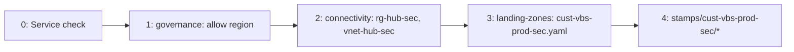

# 05 — Landing zones

> Part of [spec v2](./README.md). Specifies the `landing-zone` module, the `lz.yaml` schema, what one apply creates in the cloud, how a new region is added, and the landing zone lifecycle. It expands [02 section 3](./02-architecture.md#3-creating-landing-zones). All names follow [`03-naming-conventions.md`](./03-naming-conventions.md).

## 1. Scope

An application landing zone (L2) is one subscription (Azure) or project (GCP) for one owner, one environment type and one region ([ADR 0015](./adr/0015-one-landing-zone-one-region.md)). It is declared in `landing-zones/<lz>.yaml` and built by the `landing-zone` module from `tl-platform`. The single root `landing-zones/_root/` calls the module once per file, with one state key per landing zone (`<lz>.tfstate` in `tfstate-lz`).

Everything a landing zone needs from the platform (L1) exists before the landing zone is created: the management groups and their policies, the regional hub, the private DNS zones, `ag-finops` and `log-platform`. The module only reads these. It never changes them, except for the hub half of its own peering and its own private DNS links (section 4, step 4).

Abbreviations used in this file:

| Abbreviation | Meaning |
|---|---|
| RBAC | Role-based access control |
| PIM | Entra Privileged Identity Management: roles are eligible and activated on demand |
| B2B | Entra business-to-business guest accounts |
| CMK | Customer-managed key: data is encrypted with a key the landing zone's Key Vault holds |
| OIDC | OpenID Connect: GitHub Actions signs in to the cloud without a stored secret |
| IPAM | IP address management: the address plan in `catalog/ipam.yaml` |

## 2. `lz.yaml` schema

```yaml
# landing-zones/cust-vbs-prod-sec.yaml
name: cust-vbs-prod-sec
state: active
cloud: azure
archetype: prod-regulated
owner: { customer: vbs }
subscription: sub-cust-vbs-prod-sec
region: swedencentral
network:
  spoke_cidr: 10.16.80.0/20
budget:
  monthly_eur: 400
  extra_recipients: [it@vbs-lawyers.example]
access:
  - group: grp-regulated-admins
    role: Contributor
    pim: true
  - group: grp-cust-vbs-admins
    role: Reader
observability:
  dedicated_workspace: true
```

| Field | Required | Values | Rule |
|---|---|---|---|
| `name` | yes | `<scope>-<envtype>-<region>[-<nn>]` | Equal to the file name. Never changes ([03 section 7.3](./03-naming-conventions.md#73-l2-application-landing-zones)) |
| `state` | yes | `active`, `decommissioned`, `cancelled` | Drives the lifecycle (section 7) |
| `cloud` | yes | `azure`, `gcp` | Selects the Azure or GCP half of the module |
| `archetype` | yes | `prod`, `prod-regulated`, `sandbox` | Selects the management group or folder (section 4, step 2) |
| `owner` | yes | A customer code, a graduated product code, or the shared products | The code must be registered in [03 section 4](./03-naming-conventions.md#4-owner-codes). Decides the invoice section |
| `subscription` | Azure | `sub-<lz>` | Must equal `sub-` + `name` |
| `region` | yes | An allowed region | Must match the region code in `name` and be allowed at `mg-root` (section 5) |
| `network.spoke_cidr` | yes | A /20 | Must be reserved for this landing zone in `catalog/ipam.yaml`: prod from `10.16.0.0/12`, sandbox from `10.32.0.0/12` |
| `budget.monthly_eur` | yes | Integer | Alert thresholds come from the module, not the file |
| `budget.extra_recipients` | no | E-mail addresses | Added to `ag-finops` for this budget only |
| `access` | no | List of `{ group, role, pim }` | `role` must be in the fixed set of landing zone roles (section 4, step 7) |
| `observability.dedicated_workspace` | no | `true`, `false` (default) | Must be `true` for `prod-regulated` |
| `decommissioned_on` | when `state` is not `active` | Date | Start of the hold (section 7) |
| `hold_days` | no | Integer, default 30 | Length of the hold (section 7) |

The invoice section is never declared. It follows from `owner`: `is-cust-<code>` for a customer, `is-products` for the shared products and every graduated product ([ADR 0011](./adr/0011-one-invoice-with-a-section-per-owner.md)).

## 3. Checks before apply

These run at plan time, so a wrong file fails in the PR, before anything is created.

| Check | Where |
|---|---|
| `name` matches the grammar and uses a registered owner code | `policy/naming.rego` |
| `region` is on the EU allow-list | `policy/regions.rego` |
| `region` matches the region code in `name` | `landing-zone` module (precondition) |
| `spoke_cidr` is the range reserved for this landing zone in `catalog/ipam.yaml` and overlaps no other range | `landing-zone` module (precondition) |
| The region's hub exists (`vnet-hub-<region code>`) | `landing-zone` module (data source; plan fails if missing) |
| Before a hub is built: its region is in the live `mg-root` allowed-locations assignment | `platform/azure/connectivity` (precondition in `hub-<code>.tf`; [ADR 0021](./adr/0021-region-order-checked-against-live-state.md)) |
| `prod-regulated` has `dedicated_workspace: true` | `landing-zone` module (precondition) |
| Cost of the change | Infracost PR comment |

## 4. What one apply creates

One `landingzones` apply with `spn-landingzones-apply` creates the resources below, in this order. Resources inside the subscription go into the landing zone's resource groups: `rg-<lz>-network`, `rg-<lz>-security` and, for a dedicated workspace, `rg-<lz>-monitoring` ([ADR 0022](./adr/0022-landing-zone-resource-groups-per-purpose.md)). The order is the module's dependency graph, so a later step never starts before the one it needs. The example is `cust-vbs-prod-sec` from section 2.

| # | Step | Azure resources (example names) | GCP equivalent |
|---|---|---|---|
| 1 | **Invoice section**, only if the owner has none yet | `is-cust-vbs` on "Trislab billing profile". Already exists for VBS, so nothing is created | Billing account label `customer` |
| 2 | **Subscription** | Subscription alias and display name `sub-cust-vbs-prod-sec`, billed to `is-cust-vbs`, placed in `mg-lz-prod-regulated`. From this moment every policy of `mg-root`, `mg-landingzones`, `mg-lz-prod` and `mg-lz-prod-regulated` applies to it. Then `rg-cust-vbs-prod-sec-network`, `rg-cust-vbs-prod-sec-security` (with a `CanNotDelete` lock) and, because the landing zone is regulated, `rg-cust-vbs-prod-sec-monitoring` (locked too); `nw-cust-vbs-prod-sec` in the network group ([ADR 0022](./adr/0022-landing-zone-resource-groups-per-purpose.md)) | Project `prj-cust-vbs-prod-sec-<nnnn>` in `fldr-lz-prod` |
| 3 | **Suffix** | `random_integer` with `keepers` on the region: the 4-digit suffix for every global name in this state ([03 section 6](./03-naming-conventions.md#6-globally-unique-names)) | Same |
| 4 | **Spoke network** | `vnet-cust-vbs-prod-sec` (`10.16.80.0/20`) in `swedencentral`; peering spoke → `vnet-hub-sec` and hub → spoke. The hub half is written into the platform connectivity subscription with the custom role "Landing zone hub peering" on `vnet-hub-sec` ([ADR 0018](./adr/0018-hub-peering-custom-role.md)). Links `vnetl-cust-vbs-prod-sec` from every `privatelink.*` zone in `rg-platform-dns` to the spoke, with the custom role "Landing zone DNS link" ([ADR 0020](./adr/0020-landing-zone-links-private-dns-zones.md)) | VPC in the landing zone's region; peering to the region's hub |
| 5 | **Key Vault** | `kv-cust-vbs-prod-<nnnn>` in `swedencentral`. For `prod-regulated`: a CMK key in the vault, used by the stamps' data services | Secret Manager in the project; Cloud KMS key ring for `prod-regulated` |
| 6 | **Budget** | `budget-cust-vbs-prod-sec` on the subscription, alerting through `ag-finops` plus `extra_recipients` | Billing budget on the project |
| 7 | **Access** | Role assignments from `access`: PIM-eligible for Trislab groups, direct for B2B guest groups such as `grp-cust-vbs-admins`. Roles are limited to the fixed set that `spn-landingzones-apply` may assign ([02 section 6](./02-architecture.md#6-identity-and-access)) | IAM bindings on the project |
| 8 | **Pipeline identities** | `spn-lz-cust-vbs-prod-sec-plan` (Reader on the subscription and Key Vault Reader on the Key Vault, federated to `pull_request`) and `spn-lz-cust-vbs-prod-sec-deploy` (Contributor on the subscription only, federated to the GitHub Environment `lz-cust-vbs-prod-sec`). The deploy identity also gets Role Based Access Control Administrator on the subscription, with a condition that allows assigning only Key Vault Secrets User and "Stamp app deploy" to service principals, and Key Vault Secrets Officer on the Key Vault, so stamps can grant their own roles and write their secrets ([ADR 0024](./adr/0024-deploy-identity-grants-stamp-roles.md)). The Environment `lz-cust-vbs-prod-sec` is created first, with its required reviewers and, as variables, the plan and deploy identities' client IDs and the subscription ID ([08 section 2](./08-pipeline.md#2-from-path-to-root-and-identity)), through the GitHub App `tl-landingzones-apply`; the federated credential follows ([ADR 0019](./adr/0019-github-app-for-landing-zone-environments.md)). The module also writes `GHCR_PULL_TOKEN` and `GHCR_PULL_TOKEN_VERSION` into the Environment, for the stamps to copy into the Key Vault ([ADR 0026](./adr/0026-vendor-credentials-through-lz-environment.md)), and gives `spn-global-plan` and `spn-global-apply` "Edge stamp reader" on the subscription, so `global/edge` can find the stamps' addresses ([ADR 0027](./adr/0027-global-edge-writes-stamp-dns-records.md)) | `sa-lz-cust-vbs-prod-deploy`, bound to `wif-github` for the same Environment |
| 9 | **Dedicated workspace**, only if `dedicated_workspace` | `log-cust-vbs-prod-sec` in `swedencentral`. The `mg-lz-prod-regulated` policy sends diagnostics here instead of `log-platform` | Log bucket in the project |

After the apply, policy (not the module) completes the landing zone:

- Diagnostic settings for every resource are deployed by the `mg-root` DeployIfNotExists policy to `log-platform`, or to the dedicated workspace for `prod-regulated`.
- Mandatory tags are enforced by the deny policy, so an untagged resource fails at apply time, not later.

The landing zone is then ready for stamps. The first stamp PR adds `stamps/cust-vbs-prod-sec/<product>/` and is applied in the Environment `lz-cust-vbs-prod-sec` with `spn-lz-cust-vbs-prod-sec-deploy`. Each stamp creates its own subnet and NSG inside the spoke, and the NSG carries the sandbox/production deny rules ([06 section 6.2](./06-stamp-templates.md#62-network), [ADR 0025](./adr/0025-stamp-nsg-carries-isolation-rules.md)).

### What is never created per landing zone or per region

These exist once and are shared by every landing zone in every region:

| Resource | Owner root |
|---|---|
| State storage `stplatformtfstate1307` and its containers. A landing zone only adds a key | `platform/azure/state` |
| `log-platform`, `kv-platform-1307`, `ag-finops` | `platform/azure/management`, `platform/azure/governance` |
| `privatelink.*` private DNS zones (global resources; only links are added) | `platform/azure/connectivity` |
| `spn-landingzones-plan`, `spn-landingzones-apply` | `platform/azure/identity` |
| Cloudflare, Front Door, GHCR | `global/` |

## 5. Adding a region

A region is added only when a stamp has to run there, and it is fully set up before the first landing zone uses it ([ADR 0016](./adr/0016-regions-added-when-needed.md)). It takes several PRs, each applied in its own GitHub Environment by its own identity. They must be applied in this order, because each needs the one before. Each PR checks at plan time that the one before it is live in the cloud, so a PR applied out of order fails at plan and creates nothing ([ADR 0021](./adr/0021-region-order-checked-against-live-state.md)).



| # | PR | Root and Environment | What changes in Azure |
|---|---|---|---|
| 0 | **Service check** (no PR, done by hand; only for a region beyond N6, open question 6 is deferred until then) | — | Nothing. Confirm that every service the stamp templates use is offered in the region, including availability zones where `zone_redundant` stamps need them ([ADR 0017](./adr/0017-availability-zones-per-stamp.md)) |
| 1 | **Allow the region.** Region added to N6 in [`01-requirements.md`](./01-requirements.md), region code added to [03 section 3](./03-naming-conventions.md#3-reserved-tokens), region added to `policy/regions.rego`, hub /20 reserved in `catalog/ipam.yaml` | `platform/azure/governance`, Environment `platform`, `spn-platform-apply` | The `mg-root` allowed-locations policy assignment is updated in place to include the region. Nothing is created. Allow for policy propagation before PR 2 |
| 2 | **Build the hub.** New file `hub-<code>.tf` | `platform/azure/connectivity`, Environment `platform`, `spn-platform-apply` | `rg-hub-sec` and `vnet-hub-sec` (the reserved /20, e.g. `10.0.16.0/20`) with an empty `GatewaySubnet`, in the new region. Links from the existing `privatelink.*` zones to `vnet-hub-sec`. On `vnet-hub-sec`: the role "Landing zone hub peering" for `spn-landingzones-apply` and Reader for `spn-landingzones-plan` ([ADR 0018](./adr/0018-hub-peering-custom-role.md)). Only if a stamp needs private cross-cloud traffic: `vgw-hub-sec` and `pip-vgw-hub-sec` (a VPN gateway takes 30–45 minutes to create and costs money every month). Diagnostics go to `log-platform` through policy |
| 3 | **Create the landing zone.** New `landing-zones/<lz>.yaml` and its spoke range in `catalog/ipam.yaml` | `landing-zones/_root`, Environment `landingzones`, `spn-landingzones-apply` | Everything in section 4 |
| 4 | **Create the stamps**, plus catalog hostnames | `stamps/<lz>/*`, Environment `lz-<lz>`; `global/edge`, Environment `global` | The stamps' resources, and DNS records in Cloudflare and Azure DNS. Each stamp is applied again after `global`, to bind its hostnames ([ADR 0027](./adr/0027-global-edge-writes-stamp-dns-records.md)) |

The hub holds no firewall, Bastion or NAT gateway. Shared egress is added to a hub only if static outbound IPs are needed ([02 section 4](./02-architecture.md#4-network)).

A GCP region follows the same PRs in `platform/gcp/governance` (`gcp.resourceLocations`) and `platform/gcp/connectivity`, as [ADR 0014](./adr/0014-gcp-region-europe-west8.md) did for `europe-west8`.

A landing zone in a region that already has a hub needs only PRs 3 and 4.

## 6. Failures and re-runs

Every apply uses the plan saved in the PR, inside the matching GitHub Environment, before merge ([02 section 8](./02-architecture.md#8-delivery-flows)). If it fails, the PR stays open.

| Situation | What happens | What to do |
|---|---|---|
| Apply fails after the subscription exists | The subscription and every finished step are in the landing zone's state. Nothing is rolled back | Fix the cause, push, let the pipeline re-plan and apply. The new plan contains only the missing steps |
| Policy denies a resource (region not allowed, tag missing) | That resource fails; earlier steps stay | Apply PR 1 first, or fix the tags, then re-plan |
| The hub doesn't exist | Plan fails at the data source (section 3). Nothing is created | Apply PR 2 first |
| Saved plan is stale (state changed since plan) | Apply refuses the plan | Re-run the plan job, then apply |

Subscriptions are never cancelled by a failed or mistaken apply: the `landingzones` layer sets `prevent_cancellation_on_destroy`, so only the `cancelled` state cancels a subscription (section 7).

## 7. Lifecycle

| `state` | What the module does | Reversible |
|---|---|---|
| `active` | Creates and keeps everything in section 4 | — |
| `decommissioned` | Removes both halves of the hub peering, the plan and deploy identities, the GitHub Environment and the `access` grants, and moves the subscription to `mg-decommissioned`, where all writes are denied. Data, costs and the budget stay | Yes, by a PR back to `active`, until `decommissioned_on + hold_days` |
| `cancelled` | Cancels the subscription. Azure keeps it disabled for about 90 days, then deletes it | No |

The five retirement steps, from removing stamps to returning the spoke range, are in [02 section 3 Decommissioning](./02-architecture.md#decommissioning).

## 8. Open questions

Several parts of this document depend on decisions not yet made. They are listed in [`TODO.md`](./TODO.md#open-questions) as questions 6–7. Both are deferred, because the initial build doesn't need them: the region service check until the first region beyond N6, and private endpoint DNS records until the first stamp template with a private endpoint.
