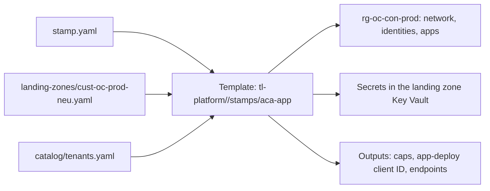
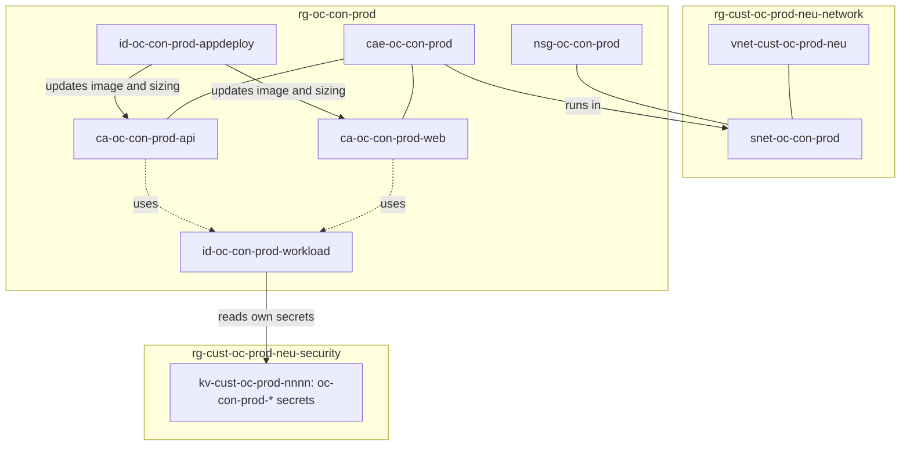

# 06 — Stamp templates

> Part of [spec v2](./README.md). Specifies the contract every stamp template keeps, the `stamp.yaml` schema, availability zones (`zone_redundant`), and the first template, `aca-app`, in full. It expands [02 section 5](./02-architecture.md#5-stamps). All names follow [`03-naming-conventions.md`](./03-naming-conventions.md).

## 1. Scope

A stamp (L3) is one instance of a versioned workload template, deployed into one application landing zone. It is declared in `stamps/<lz>/<folder>/stamp.yaml`, next to a generated `main.tf` that pins the template version. It is applied in the GitHub Environment `lz-<lz>` with `spn-lz-<lz>-deploy`, with its own state key `<lz>/<folder>.tfstate` in `tfstate-stamps`.

Templates live in `tl-platform` under `stamps/<template>/` and are released as git tags. This document specifies:

- the contract every template keeps (section 2), the `stamp.yaml` fields every template shares (section 3) and the checks that run before apply (section 4);
- what `zone_redundant` does for each service (section 5);
- `aca-app` v1, the first template (sections 6–7);
- versions, ephemeral stamps and the stamp lifecycle (sections 8–10).

`aks-app`, `functions-app` and `cloudrun-app` keep the same contract. Their own fields are added here when each one is built (section 11).

The rights a stamp's deploy identity has come from [ADR 0024](./adr/0024-deploy-identity-grants-stamp-roles.md), and the sandbox/production NSG rules from [ADR 0025](./adr/0025-stamp-nsg-carries-isolation-rules.md). Vendor credentials reach a stamp through its landing zone's GitHub Environment ([ADR 0026](./adr/0026-vendor-credentials-through-lz-environment.md)), and `global/edge` writes its DNS records ([ADR 0027](./adr/0027-global-edge-writes-stamp-dns-records.md)).

Abbreviations used in this file:

| Abbreviation | Meaning |
|---|---|
| ACA | Azure Container Apps |
| RBAC | Role-based access control |
| PIM | Entra Privileged Identity Management: roles are eligible and activated on demand |
| FQDN | Fully qualified domain name, e.g. `app.okna-capris.si` |
| TTL | Time to live: how long an ephemeral stamp exists before it is destroyed |
| IPAM | IP address management: the address plan in `catalog/ipam.yaml` |

## 2. The template contract

A template is an OpenTofu module. It takes three inputs, all passed by the generated `main.tf`, and nothing else:

| Input | From | Holds |
|---|---|---|
| `config` | `stamp.yaml` | Everything in section 3 and the template's own fields |
| `lz` | `landing-zones/<lz>.yaml` | Name, owner, archetype, region, spoke range. A stamp has no `region` field; it runs in its landing zone's region ([ADR 0015](./adr/0015-one-landing-zone-one-region.md)) |
| `tenants` | `catalog/tenants.yaml`, filtered to this stamp | Each tenant's name and hostnames, and the app each hostname goes to. The rest of the catalog schema is in [`07-catalog-and-ipam.md`](./07-catalog-and-ipam.md) |



Every template:

1. creates its resources in its own resource group `rg-<stamp>`, in the landing zone's region, and nothing in the landing zone's resource groups except its subnet in the spoke ([ADR 0022](./adr/0022-landing-zone-resource-groups-per-purpose.md));
2. creates its own subnet `snet-<stamp>` in `vnet-<lz>`, with its own NSG `nsg-<stamp>` carrying the baseline rules (section 6.2);
3. creates a workload identity `id-<stamp>-workload` with read access to each of its own secrets in the landing zone's Key Vault, one secret at a time (section 6.4);
4. creates an app-deploy identity `id-<stamp>-appdeploy`, federated to the app repositories' GitHub Environments, that can update this stamp's apps and nothing else (section 6.3);
5. binds every hostname the catalog maps to the stamp, once `global/edge` has written its DNS records (section 6.6);
6. sets the four mandatory tags on every resource it creates ([03 section 9](./03-naming-conventions.md#9-tags-and-labels)): `Product` is the stamp's `product`, `Customer` is the landing zone owner's full slug (`trislab` for the shared products), `EnvironmentType` is the landing zone's environment type, `EnvironmentName` is the stamp's `environment`;
7. publishes the sizing caps that `platform.yaml` is checked against, as outputs and on each app (section 6.5);
8. sets `ignore_changes` on image and sizing, so app deploys never show as drift;
9. generates every resource name from the stamp code (section 3.2). Nobody writes a name by hand ([03 section 11](./03-naming-conventions.md#11-enforcement)).

A template never creates a subscription, a resource group outside the stamp, a peering, a DNS zone, a DNS record or a Key Vault. Those belong to the layers below.

### 2.1 Generated `main.tf`

```hcl
# stamps/cust-oc-prod-neu/construction/main.tf  (generated, never hand-edited)
terraform {
  backend "azurerm" {
    resource_group_name  = "rg-platform-state"
    storage_account_name = "stplatformtfstate1307"
    container_name       = "tfstate-stamps"
    key                  = "cust-oc-prod-neu/construction.tfstate"
    use_oidc             = true
  }
}

provider "azurerm" {
  features {
    key_vault { recover_soft_deleted_secrets = true }
  }
  use_oidc = true               # client ID and subscription ID come from the lz-cust-oc-prod-neu Environment
}

module "stamp" {
  source  = "git::https://github.com/<org>/tl-platform.git//stamps/aca-app?ref=v1.4.0"
  config  = yamldecode(file("${path.module}/stamp.yaml"))
  lz      = yamldecode(file("${path.root}/../../../landing-zones/cust-oc-prod-neu.yaml"))
  tenants = [for t in yamldecode(file("${path.root}/../../../catalog/tenants.yaml")).tenants : t
             if t.stamp == "cust-oc-prod-neu/construction"]
}

output "stamp" { value = module.stamp }
```

`stamp-check.yml` regenerates `main.tf` from `stamp.yaml` and fails the PR if the two differ, or if `ref` doesn't match `version` ([02 section 5](./02-architecture.md#5-stamps)). `recover_soft_deleted_secrets` lets a re-created stamp take back its soft-deleted secrets instead of failing on the name (section 10).

## 3. `stamp.yaml` schema

```yaml
# stamps/cust-oc-prod-neu/construction/stamp.yaml
template: aca-app
version: v1.4.0
lz: cust-oc-prod-neu
product: construction
environment: prod
tenancy: dedicated
zone_redundant: false
network:
  subnet_cidr: 10.16.16.0/26
apps:
  - name: web
    repo: construction-web
    profile: Consumption
    ingress: external
    port: 8080
    caps: { cpu: 1, memory: 2Gi, max_replicas: 10 }
    secrets: [session-key]
  - name: api
    repo: construction-api
    profile: Dedicated-D4
    ingress: internal
    port: 8080
    caps: { cpu: 2, memory: 4Gi, max_replicas: 6 }
workload_profiles:
  Dedicated-D4: { min_nodes: 1, max_nodes: 3 }
data:
  postgres: { provider: neon }
  cache: { provider: upstash }
```

Each template release includes a JSON schema for its `stamp.yaml`. `stamp-check.yml` validates every changed `stamp.yaml` against the schema of the version it pins.

### 3.1 Fields every template has

"Fixed" means the value can't change once the stamp exists. Changing it means a new stamp (section 10).

| Field | Required | Values | Rule | Fixed |
|---|---|---|---|---|
| `template` | yes | `aca-app` (later `aks-app`, `functions-app`, `cloudrun-app`) | Selects `tl-platform//stamps/<template>` | yes |
| `version` | yes | `vX.Y.Z` | A released tag. Bumped per stamp, ring by ring (section 8) | no |
| `lz` | yes | A landing zone name | Equal to the parent folder name. The landing zone's `state` must be `active` | yes |
| `product` | yes | A product full slug | Registered in [03 section 4](./03-naming-conventions.md#4-owner-codes). Gives the product code and the `Product` tag | yes |
| `environment` | yes | `dev`, `test`, `uat`, `perf`, `demo`, `staging`, `pr<n>`, `prod` | `prod` only in a prod landing zone, and only `prod` there. Every other value only in a sandbox landing zone. Becomes the `EnvironmentName` tag | yes |
| `number` | no | `01`, `02`, … | Only when the owner already has a stamp with the same product and environment (section 3.2) | yes |
| `tenancy` | yes | `shared`, `dedicated` | Section 7 | no |
| `zone_redundant` | no | `true`, `false` (default) | Section 5, [ADR 0017](./adr/0017-availability-zones-per-stamp.md) | yes |
| `network.subnet_cidr` | yes | A /27 or larger | Reserved for this stamp in `catalog/ipam.yaml`, inside the landing zone's `spoke_cidr` | yes |
| `app_environment` | no | A GitHub Environment name in the app repositories | The Environment the app-deploy identity trusts. Default: `environment` when it is `dev`, `test` or `prod`; required otherwise (section 6.3) | no |
| `ttl` | no | `<n>h` or `<n>d`, at most `30d` | Only in sandbox landing zones. Required for `pr<n>` (section 9) | no |

### 3.2 The stamp code

The template builds the stamp code from the fields, following [03 section 7.4](./03-naming-conventions.md#74-l3-stamps):

```text
<owner-code>-<product-code>-<environment>[-<number>]
```

| Landing zone owner | `<owner-code>` | Example |
|---|---|---|
| Shared products (`products-*`) | `shr` | `products-prod-neu`, `construction`, `prod`, `01` → `shr-con-prod-01` |
| Customer (`cust-<code>-*`) | the customer code | `cust-oc-prod-neu`, `construction`, `prod` → `oc-con-prod` |
| Graduated product (`prdt-<code>-*`) | none | `prdt-con-prod-neu`, `construction`, `prod` → `con-prod` |

The folder name is free and readable (`construction-shared-01`). The stamp code must be unique across the repository, and that is checked on every plan (section 4). The longest possible code is 18 characters, e.g. `shr-con-staging-01`.

### 3.3 `aca-app` fields

| Field | Required | Values | Rule |
|---|---|---|---|
| `apps` | yes | 1–10 entries | One container app each |
| `apps[].name` | yes | 2–10 lowercase letters and digits, starting with a letter | Unique in the stamp. The limit keeps `ca-<stamp>-<app>` within 32 characters ([03 section 10](./03-naming-conventions.md#10-limits)) |
| `apps[].repo` | yes | An app repository name | Its GitHub Environment `app_environment` is trusted by the app-deploy identity (section 6.3) |
| `apps[].profile` | yes | `Consumption`, `Dedicated-<type>` with `<type>` one of `D4`, `D8`, `D16`, `D32`, `E4`, `E8`, `E16`, `E32` | The profile the app starts on. A `Dedicated-<type>` must be listed in `workload_profiles` |
| `apps[].ingress` | no | `external`, `internal` (default), `none` | `external`: reachable from Cloudflare (and Front Door in prod) on port 443. `internal`: only from the other apps in the stamp. `none`: no ingress, e.g. a worker |
| `apps[].port` | when ingress is not `none` | 1–65535 | The port the container listens on |
| `apps[].caps.cpu` | yes | vCPU per replica | At most 4 on `Consumption`; at most the profile's vCPU on a Dedicated profile |
| `apps[].caps.memory` | yes | `<n>Gi` per replica | At most `8Gi` on `Consumption`; at most the profile's memory on a Dedicated profile |
| `apps[].caps.max_replicas` | yes | 1–300 | Upper limit for scaling |
| `apps[].caps.profiles` | no | Profiles from `workload_profiles`, or `Consumption` | Profiles `platform.yaml` may move the app to. Default: only `profile` |
| `apps[].secrets` | no | Secret names: lowercase letters, digits, `-` | Secrets the app reads from the landing zone Key Vault (section 6.4) |
| `apps[].env` | no | Map of name → value | Non-secret settings the platform sets on the app. No secrets here |
| `workload_profiles` | when any app uses a Dedicated profile | Map of `Dedicated-<type>` → `{ min_nodes, max_nodes }` | Node counts of each Dedicated profile. `max_nodes` at most 20 |
| `data.postgres.provider` | no | `neon` | Adds `db-neon` (section 6.7). `postgres` (managed PostgreSQL) comes with the release that resolves open question 7 |
| `data.cache.provider` | no | `upstash` | Adds `cache-upstash` (section 6.7) |

## 4. Checks before apply

These run at plan time, so a wrong file fails in the PR, before anything is created.

| Check | Where |
|---|---|
| `stamp.yaml` matches the JSON schema of the pinned version | `stamp-check.yml` |
| `main.tf` equals the generator's output, and `ref` equals `version` | `stamp-check.yml` |
| The stamp code is unique across `stamps/**` and uses registered codes | `stamp-check.yml`; `policy/naming.rego` |
| `lz` equals the parent folder, and the landing zone is `active` | Template (precondition) |
| `environment` fits the landing zone's environment type (section 3.1) | Template (precondition) |
| `subnet_cidr` is the range reserved for this stamp in `catalog/ipam.yaml`, is inside the spoke and is a /27 or larger | Template (precondition) |
| A stamp in a customer landing zone has `tenancy: dedicated`; a dedicated stamp has exactly one tenant (section 7) | Template (precondition) |
| `ttl` only in a sandbox landing zone; `pr<n>` has a `ttl` (section 9) | Template (precondition) |
| `zone_redundant: true` only in a region with availability zones ([ADR 0017](./adr/0017-availability-zones-per-stamp.md)). The template holds the list; `northeurope`, `italynorth` and `europe-west8` are on it | Template (precondition) |
| `zone_redundant: true` needs every app's lower replica limit and every Dedicated profile's `min_nodes` to be at least 2 (section 5) | Template (precondition) |
| Caps fit the profile's limits (section 3.3) | Template (variable validation) |
| Mandatory tags present with allowed values | `policy/tags.rego` |
| Cost of the change | Infracost PR comment |

After the plan, the policies of the landing zone's management group still apply at apply time, e.g. the SKU lists of `mg-lz-sandbox` and `mg-lz-prod` ([02 section 2](./02-architecture.md#2-governance-hierarchy)).

## 5. Availability zones

`zone_redundant` is off by default and covers the whole stamp ([ADR 0017](./adr/0017-availability-zones-per-stamp.md)). With `true`, the template turns on the zone option of every service in the stamp whose OpenTofu provider has one. A service whose provider has no zone option stays as it is.

The setting is fixed after creation (section 3.1): turning it on or off recreates the Container Apps environment, and with it every app of the stamp. Decide before the stamp goes live.

| Service | Template | Provider setting | `false` | `true` |
|---|---|---|---|---|
| Container Apps environment | `aca-app` | `zone_redundancy_enabled` on `azurerm_container_app_environment`. Can't change in place | One zone chosen by Azure | Replicas and Dedicated nodes spread over the region's zones |
| Container app replicas | `aca-app` | `min_replicas` | Lower limit 0 (scale to zero) | Lower limit 2, so each app keeps running if one zone fails. Scale to zero is off, so idle apps cost money |
| Dedicated workload profile nodes | `aca-app` | `minimum_count` on the profile | `min_nodes` as declared | `min_nodes` at least 2 |
| Neon Postgres (`db-neon`) | `aca-app` | None | Neon's own resilience | No effect |
| Upstash Redis (`cache-upstash`) | `aca-app` | None | Upstash's own resilience | No effect |
| Landing zone Key Vault | — | Not the stamp's | Zone-redundant by default in regions with zones | Same |
| AKS node pools | `aks-app` | `zones` on the node pool | No zones | Zones 1, 2 and 3 |
| PostgreSQL flexible server (`db-postgres`) | later | `high_availability.mode` | No standby | `ZoneRedundant`: standby in another zone |
| Storage account | later | `account_replication_type` | `LRS` | `ZRS` |
| Cloud Run | `cloudrun-app` | None: Cloud Run is regional and spreads over zones by itself | Same | Same |
| Cloud SQL for PostgreSQL | `cloudrun-app` | `availability_type` | `ZONAL` | `REGIONAL` |

The rows for templates other than `aca-app` are the provider's options. Each template's own behaviour is confirmed when it is built (section 11).

## 6. `aca-app`

`aca-app` runs 1–10 container apps in one Container Apps environment with workload profiles, so an app can run on the serverless `Consumption` profile or on Dedicated nodes. It is the template for SaaS products, websites and single-page apps (F4).



### 6.1 What one apply creates

One stamp apply with `spn-lz-<lz>-deploy` creates the resources below. The order is the template's dependency graph. The example is `oc-con-prod` from section 3. `aca-app` v1 has no globally unique names, so it creates no suffix.

| # | Step | Resources (example names) |
|---|---|---|
| 1 | **Resource group** | `rg-oc-con-prod` in `northeurope` |
| 2 | **Network** | `snet-oc-con-prod` (`10.16.16.0/26`) in `vnet-cust-oc-prod-neu`, delegated to `Microsoft.App/environments`; `nsg-oc-con-prod` with the baseline rules (section 6.2), attached to the subnet |
| 3 | **Identities** | `id-oc-con-prod-workload`; `id-oc-con-prod-appdeploy` with one federated credential per app repository (section 6.3) |
| 4 | **Secrets** | In the landing zone's Key Vault: `oc-con-prod-session-key` and the data secrets from step 7. One Key Vault Secrets User assignment per secret for `id-oc-con-prod-workload` (section 6.4) |
| 5 | **Environment** | `cae-oc-con-prod` on `snet-oc-con-prod`, with the `Consumption` profile and `Dedicated-D4` (1–3 nodes); zone redundancy from `zone_redundant`; Azure's own resources for it in `rg-oc-con-prod-infra` |
| 6 | **Apps** | `ca-oc-con-prod-web` (external ingress) and `ca-oc-con-prod-api` (internal), each with the workload identity, its secrets as Key Vault references, a placeholder image, the smallest size and the `SizingCaps` tag (section 6.5); hostnames bound to `web` once their records exist (section 6.6); the role "Stamp app deploy" on each app for `id-oc-con-prod-appdeploy` |
| 7 | **Data** | `db-neon` and `cache-upstash`, each once its credential is in `lz-cust-oc-prod-neu` (section 6.7) |

After the apply, policy completes the stamp as for a landing zone ([05 section 4](./05-landing-zones.md#4-what-one-apply-creates)): the `mg-root` DeployIfNotExists policy adds the diagnostic settings of the environment, to `log-platform` or the landing zone's dedicated workspace.

**To check in the pilot:** the tag deny policy may block `rg-oc-con-prod-infra`, which Azure creates for the environment. If Azure doesn't copy the environment's tags to it, the policy gets an exemption for resource groups created by `Microsoft.App`.

### 6.2 Network

Each stamp takes its own subnet from the landing zone's spoke. The environment needs a /27 or larger ([02 section 4](./02-architecture.md#4-network)). Use a /27 when all apps run on `Consumption` and a /26 or larger when Dedicated profiles are used, because each Dedicated node takes an address. The environment can't move to another subnet without being recreated, which is why `subnet_cidr` is fixed.

`nsg-<stamp>` carries these baseline rules. The template writes them from the landing zone's environment type and spoke range, and `stamp.yaml` can't change them ([ADR 0025](./adr/0025-stamp-nsg-carries-isolation-rules.md)).

| Priority | Direction | From → to | Action | Why |
|---|---|---|---|---|
| 100 | In | `snet-<stamp>` → `snet-<stamp>` | Allow | Replicas and apps of the stamp talk to each other |
| 200 | In | Cloudflare's published IP ranges → port 443 | Allow | Public ingress, only when an app has `ingress: external` (N7) |
| 210 | In | Service tag `AzureFrontDoor.Backend` → port 443 | Allow | Front Door failover; only in prod landing zones, which Front Door mirrors |
| 220 | In | Service tag `AzureLoadBalancer` → any | Allow | Health probes of the environment |
| 4000 | In | The other environment type's range (`10.32.0.0/12` in prod, `10.16.0.0/12` in sandbox) | Deny | No traffic between sandbox and production (N4) |
| 4010 | In | The landing zone's `spoke_cidr` | Deny | No traffic from other stamps' subnets ([02 section 4](./02-architecture.md#4-network)) |
| 4000 | Out | → the other environment type's range | Deny | Same as inbound (N4) |

The template reads Cloudflare's IP ranges at plan time from Cloudflare's published list. When Cloudflare changes the list, the nightly drift check shows it, and the next apply updates the rule. Outbound traffic to the internet stays allowed, because the environment needs it for images, certificates and Azure Monitor.

### 6.3 Apps and the app-deploy identity

The template creates every app with a public placeholder image from GHCR (`ghcr.io/<org>/platform-placeholder`), 0.25 vCPU and 0.5 GiB. The first app deploy replaces both. From then on the image, CPU, memory, replica limits and profile belong to the app repository's CI (F9), and the template ignores them.

Every app gets `ghcr.io` as its registry, with the machine user as username and the secret `<stamp>-ghcr-pull` as password, read through the workload identity. So the first deploy of a private image needs no change to the app's identity or secrets. The template copies the token from the Environment secret `GHCR_PULL_TOKEN` ([ADR 0026](./adr/0026-vendor-credentials-through-lz-environment.md)).

`id-<stamp>-appdeploy` is what app CI signs in as. It has:

- one federated credential per distinct `apps[].repo`, for the subject `repo:<org>/<repo>:environment:<app_environment>`. With the default, the dev stamp trusts the app repository's `dev` Environment, the test stamp `test` and the prod stamp `prod`, which gives the promotion flow in [02 section 8](./02-architecture.md#8-delivery-flows);
- the custom role **"Stamp app deploy"** on each of the stamp's apps, and nothing else ([ADR 0024](./adr/0024-deploy-identity-grants-stamp-roles.md)). It can read and update the apps and their revisions, but can't read their secrets, attach another identity or touch any other resource.

Azure can't limit which properties of an app the role changes. The limit is kept in two places: the platform's deploy workflow in `tl-template-*` only changes image and sizing, and the nightly drift check reports any other change, because `ignore_changes` covers only image and sizing.

Apps reach each other inside the environment by app name, e.g. `http://ca-oc-con-prod-api`. The template sets these settings on every app, next to `apps[].env`:

| Setting | Value |
|---|---|
| `PLATFORM_STAMP` | The stamp code, e.g. `oc-con-prod` |
| `PLATFORM_ENVIRONMENT` | `environment` |
| `PLATFORM_TENANCY` | `shared` or `dedicated` |
| `PLATFORM_TENANTS` | The tenant names from the catalog, comma-separated |

### 6.4 Secrets

Secrets live in the landing zone's Key Vault, `kv-<scope>-<envtype>-<nnnn>` in `rg-<lz>-security`. The template finds it by type in that resource group, because its suffix is in the landing zone's state. Each secret is named `<stamp>-<name>`, e.g. `oc-con-prod-session-key` ([03 section 7.4](./03-naming-conventions.md#74-l3-stamps)).

| Kind | Example | Value written by |
|---|---|---|
| Declared in `apps[].secrets` | `oc-con-prod-session-key` | The template creates it with a placeholder and never changes it again. An engineer sets the real value through PIM |
| Made by a building block | `oc-con-prod-postgres-url` | The building block, on every apply (section 6.7) |
| Handed over through `lz-<lz>` | `oc-con-prod-redis-url`, `oc-con-prod-ghcr-pull` | The template copies it from the Environment secret whenever its `_VERSION` variable changes ([ADR 0026](./adr/0026-vendor-credentials-through-lz-environment.md)) |

The workload identity gets Key Vault Secrets User on each of its own secrets, not on the vault. So a stamp can read its own secrets at runtime and no other stamp's, even in the same landing zone. Each app gets its secrets as Key Vault references through the workload identity. A secret `session-key` appears in the app as `SESSION_KEY`.

The template writes secret values as write-only values, so they are never stored in the stamp's state and the plan identity never has to read them ([ADR 0024](./adr/0024-deploy-identity-grants-stamp-roles.md)). Credentials from the Environment arrive as ephemeral input variables, so they aren't stored in the saved plan either, and only the apply job gets them ([ADR 0026](./adr/0026-vendor-credentials-through-lz-environment.md)).

`aca-app` v1 reaches the Key Vault through its public endpoint, with RBAC. A landing zone whose Key Vault allows only private access needs private endpoints, which wait for open question 7.

### 6.5 Sizing caps and `platform.yaml`

A developer sets CPU, memory, replicas and profile in the app's `platform.yaml`, within the caps of the stamp it deploys to (F9). The caps are in `stamp.yaml`, and the template publishes them in two places:

- as the output `caps`, per app;
- as the tag `SizingCaps` on each app, e.g. `cpu=1;memory=2Gi;minreplicas=0;maxreplicas=10;profiles=Consumption` ([03 section 9](./03-naming-conventions.md#9-tags-and-labels)).

App CI reads the tag with the app-deploy identity, which can read the app, and fails before deploying if `platform.yaml` asks for more. `minreplicas` is 2 when `zone_redundant` is `true` (section 5), and 0 otherwise. The caps change only through a `stamp.yaml` PR.

### 6.6 Hostnames

For each hostname the catalog maps to the stamp, the template binds the hostname to the target app, with a certificate managed by Container Apps. Only apps with `ingress: external` can take hostnames. Traffic arrives through Cloudflare, and in prod also through the Front Door mirror ([02 section 9](./02-architecture.md#9-cross-cutting-concerns)).

Binding a hostname needs DNS records: one that points the hostname at the environment and one that proves ownership (`asuid.<hostname>`, holding the environment's verification ID). `global/edge` writes both, in Cloudflare and Azure DNS, from the catalog. It finds the environment's address and verification ID by looking the environment up by name ([ADR 0027](./adr/0027-global-edge-writes-stamp-dns-records.md)). The template writes no DNS records.

The template binds a hostname only when its `asuid` record holds the environment's verification ID, and skips it otherwise. The pipeline applies the stamp again after the `global` apply, and that apply binds it. The template still exports the environment's address and verification ID as outputs, for troubleshooting.

### 6.7 Data building blocks

| Block | Creates | Secret | Setting in the app |
|---|---|---|---|
| `db-neon` | A database and role for the stamp in its Neon project, which is named after the stamp code ([03 section 7.1](./03-naming-conventions.md#71-l0-global)), with the project-scoped key from `NEON_KEY_<STAMP>` | `<stamp>-postgres-url` | `DATABASE_URL` |
| `cache-upstash` | Nothing in Upstash: it copies the connection URL of the stamp's database from `REDIS_URL_<STAMP>` | `<stamp>-redis-url` | `REDIS_URL` |

`global/external-providers` creates the Neon project and the Upstash database, and writes their credentials into the landing zone's Environment `lz-<lz>` ([04](./04-repository-structure.md), [ADR 0026](./adr/0026-vendor-credentials-through-lz-environment.md)). A data block whose credential isn't there yet is skipped, and the stamp completes on its next apply.

Managed PostgreSQL (`db-postgres`) needs a private endpoint or a delegated subnet, and with it a DNS record in a `privatelink.*` zone. It is added to `aca-app` in the release that resolves open question 7. Stamps that need it, such as the regulated `vbs-con-prod`, wait for that release.

### 6.8 Observability

The environment sends its logs to Azure Monitor. The diagnostic settings come from policy, so the template creates none (section 6.1). Sending app metrics and logs to Prometheus and Loki is part of the observability platform app ([02 section 9](./02-architecture.md#9-cross-cutting-concerns)), specified with it.

### 6.9 What `aca-app` needs from a region

This is the input for the region service check, which is deferred until the first region beyond N6 (open question 6).

| Needs | With `zone_redundant: true` |
|---|---|
| `Microsoft.App/managedEnvironments` with workload profiles | Availability zones for Container Apps |
| The Dedicated profile types the stamp uses | Same |
| `Microsoft.ManagedIdentity/userAssignedIdentities` with federated credentials | — |
| A Neon and an Upstash region in the EU (N6), close to the Azure region | — |

## 7. Tenancy

Tenancy is a parameter, not a code path ([02 section 1](./02-architecture.md#1-layer-model), F3). Both values build the same resources.

| | `shared` | `dedicated` |
|---|---|---|
| Tenants in the catalog | 0..n | Exactly 1 |
| Allowed landing zones | `products-*` and `prdt-*` | Any |
| Hostnames bound | Every tenant's | The one tenant's |
| Example | `shr-con-prod-01`, many small construction customers | `oc-con-prod`, Okna Capris only |

Customer landing zones take only dedicated stamps, so a customer never shares a stamp with anyone else (N4). A single-tenant product such as `website-trislab` is a dedicated stamp in a products landing zone.

A setting on a shared stamp applies to every tenant on it, including `zone_redundant` ([ADR 0017](./adr/0017-availability-zones-per-stamp.md)). A tenant that needs something different moves to its own stamp.

## 8. Versions and upgrades

A template version is a git tag in `tl-platform`, following semantic versioning:

| Part | Bumped when | Example |
|---|---|---|
| Major | A stamp needs a `stamp.yaml` change, or the plan recreates a resource that holds data or traffic | Renaming a field; moving the environment to a new subnet layout |
| Minor | New optional fields or new resources, with no change for stamps that don't use them | Adding `data.postgres.provider: postgres` |
| Patch | Fixes with no change to the interface | A corrected NSG rule, a provider upgrade |

Renovate bumps `version` ring by ring, and a ring's PR opens only after the previous ring is applied ([02 section 5](./02-architecture.md#rollout-rings), [ADR 0009](./adr/0009-ring-based-template-rollout.md)). A major version is not bumped by Renovate. Its release notes list the `stamp.yaml` changes, and the PR that bumps it makes them in the same commit.

A plan that recreates the Container Apps environment is a stop sign in review: it restarts every app of the stamp and changes its address and verification ID.

## 9. Ephemeral stamps

Ephemeral stamps are normal stamps with a `ttl` ([02 section 5](./02-architecture.md#ephemeral-stamps)). They are allowed only in sandbox landing zones.

| Rule | Detail |
|---|---|
| Expiry | The TTL counts from the commit that added the stamp's folder to `main`, and is at most 30 days |
| Clean-up | `scheduled-cleanup.yml` finds expired stamps, destroys each with its landing zone's deploy identity, and opens a PR removing the folder |
| PR previews | The pipeline creates `stamps/<lz>/<product>-pr<n>/` when an app PR asks for a preview, with `environment: pr<n>` and a `ttl`, and removes it when the app PR closes or the TTL passes, whichever comes first |
| Extending | A PR that changes `ttl` |

Ephemeral stamps use the same template and version as the other stamps of their landing zone, so they are in ring 0 with them.

## 10. Lifecycle

| Action | How | Notes |
|---|---|---|
| **Create** | PR adding `stamps/<lz>/<folder>/stamp.yaml` and the generated `main.tf`, the subnet in `catalog/ipam.yaml` and the tenants' hostnames in `catalog/tenants.yaml`. Applied in `lz-<lz>` and `global` | The app repository gets the app-deploy identity's client ID as GitHub Environment variables, from the output `appdeploy_client_id` ([02 section 11](./02-architecture.md#11-key-scenarios)). The first stamp apply leaves the hostnames unbound and skips data blocks without credentials. After `global` has written the records and credentials, the pipeline applies the stamp again ([ADR 0026](./adr/0026-vendor-credentials-through-lz-environment.md), [ADR 0027](./adr/0027-global-edge-writes-stamp-dns-records.md)) |
| **Change** | PR changing `stamp.yaml`, or a Renovate ring PR changing `version` | A change to a fixed field (section 3.1) is refused by the template |
| **Destroy** | PR removing the folder. The pipeline destroys the stamp with the landing zone's deploy identity, then the subnet returns to `catalog/ipam.yaml` | The secrets go into the Key Vault's soft delete. A stamp created again with the same code recovers them |
| **Move** | Create the new stamp in the target landing zone, re-point the hostnames in the catalog, then destroy the old stamp | Used for graduation and region moves. The stamp code changes when the owner changes ([02 section 11](./02-architecture.md#11-key-scenarios)) |

Destroying a landing zone's last stamp is step 1 of decommissioning the landing zone ([02 section 3](./02-architecture.md#decommissioning)).

If an apply fails, the PR stays open and the finished resources stay in the stamp's state. Fix the cause and re-run the plan and apply, as for a landing zone ([05 section 6](./05-landing-zones.md#6-failures-and-re-runs)). Which parts of `tfstate-stamps` each deploy identity can read and write is specified with the pipeline in [08 section 7](./08-pipeline.md#7-state-access).

## 11. Other templates

| Template | Status | First stamps | Notes |
|---|---|---|---|
| `aca-app` | Specified here (v1) | `shr-web-staging` and `shr-web-prod` (product pilot), then `asg-con-dev`, `asg-con-test` and `asg-con-prod` (customer pilot) ([10](./10-roadmap.md)) | — |
| `aks-app` | Specified when built | `oc-erp-dev`, `oc-erp-test`, `oc-erp-prod` | AKS creates its own node resource group, with the same tag question as `rg-<stamp>-infra` |
| `functions-app` | Specified when built | `oc-rpt-*` | Function apps have global names, so this template creates a suffix ([03 section 6](./03-naming-conventions.md#6-globally-unique-names)) |
| `cloudrun-app` | Specified when built, with the first GCP customer ([ADR 0008](./adr/0008-gcp-built-on-first-customer.md)) | `reh-con-*` | Same contract with GCP resources: a service account per identity, Secret Manager instead of Key Vault, firewall rules instead of an NSG |

Each keeps the contract in section 2 and the fields in section 3.1, and adds its own fields to this document.

## 12. Decisions and open questions

| Item | Affects | Status |
|---|---|---|
| [ADR 0024](./adr/0024-deploy-identity-grants-stamp-roles.md): the deploy identity may grant the stamps' own roles and write secrets | Section 6.1 steps 4 and 6, sections 6.3 and 6.4 | accepted |
| [ADR 0025](./adr/0025-stamp-nsg-carries-isolation-rules.md): every stamp's NSG carries the sandbox/production deny rules | Section 6.2 | accepted |
| Open question 7: private endpoint DNS records | Sections 6.4 and 6.7 (`db-postgres`) | deferred |
| [ADR 0026](./adr/0026-vendor-credentials-through-lz-environment.md): vendor credentials reach a stamp through its landing zone's GitHub Environment | Sections 6.3, 6.4 and 6.7 | accepted |
| [ADR 0027](./adr/0027-global-edge-writes-stamp-dns-records.md): `global/edge` writes every stamp's DNS records | Sections 2, 6.1, 6.6 and 10 | accepted |

The questions are tracked in [`TODO.md`](./TODO.md#open-questions).
