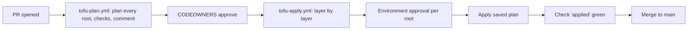

# 08 — Pipeline

> Part of [spec v2](./README.md). Specifies how a change in `tl-cloud-infrastructure` becomes a plan, passes its checks and gates, and is applied: the mapping from path to identity, the workflows, the order of applies, state access and drift. It expands [02 section 8](./02-architecture.md#8-delivery-flows) and [04 section 5](./04-repository-structure.md#5-from-path-to-identity). All names follow [`03-naming-conventions.md`](./03-naming-conventions.md).

## 1. Scope

Every infrastructure change is a pull request. The pipeline plans each root the PR touches with that root's plan identity, runs the checks, and after approval applies the saved plan with the root's apply identity, **before merge**, so `main` always matches what is live (N1). The workflows are plain GitHub Actions (proposed [ADR 0030](./adr/0030-pipeline-is-plain-github-actions.md)).

App repositories have their own build-and-promote workflow from `tl-template-*` ([02 section 8](./02-architecture.md#application-change)). It is specified with the app template, not here.

Abbreviations used in this file:

| Abbreviation | Meaning |
|---|---|
| OIDC | OpenID Connect: GitHub Actions signs in to the cloud without a stored secret |
| CR | An iTop Change Request |
| JSON plan | The output of `tofu show -json` for a saved plan, which the checks read |

## 2. From path to root and identity

A **root** is one folder with `.tf` files, or one landing zone key of `landing-zones/_root` ([04 section 1](./04-repository-structure.md#1-how-to-read-the-tree)). The detect job lists the roots a PR touches, directly or through the files they read.

| Changed path | Roots planned | Plan identity | Apply Environment and identity | State |
|---|---|---|---|---|
| `global/<root>/**` | `global/<root>` | `spn-global-plan` | `global`, `spn-global-apply` | `tfstate-global`, key `<root>.tfstate` |
| `platform/azure/<root>/**` | `platform/azure/<root>` | `spn-platform-plan` | `platform`, `spn-platform-apply` | `tfstate-platform`, key `<root>.tfstate` |
| `platform/gcp/<root>/**` | `platform/gcp/<root>` | `sa-platform-plan` | `platform`, `sa-platform-apply` | `gcs-platform-tfstate-<nnnn>`, prefix `<root>` |
| `platform/apps/<app>/<env>/**` | That folder | `spn-platform-plan` | `platform`, `spn-platform-apply` | `tfstate-platform`, key `apps-<app>-<env>.tfstate` |
| `landing-zones/<lz>.yaml` | `landing-zones/_root` for `<lz>`, and every stamp in `stamps/<lz>/` | `spn-landingzones-plan`; for the stamps, `spn-lz-<lz>-plan` | `landingzones`, `spn-landingzones-apply`; stamps as below | `tfstate-lz`, key `<lz>.tfstate` |
| `landing-zones/_root/**` | `landing-zones/_root` for every landing zone | `spn-landingzones-plan` | `landingzones`, `spn-landingzones-apply` | Every key in `tfstate-lz` |
| `stamps/<lz>/<folder>/**` | That stamp | `spn-lz-<lz>-plan` | `lz-<lz>`, `spn-lz-<lz>-deploy` | `tfstate-stamps`, key `<lz>/<folder>.tfstate` |
| `catalog/tenants.yaml` | `global/edge`, and every stamp whose entries changed | As above | As above | As above |
| `catalog/ipam.yaml` | The hub, landing zone or stamp whose range changed | As above | As above | As above |
| `policy/**` | None. The rule tests in `policy/` run | — | — | — |
| `.github/**`, `renovate.json` | None. The workflows are linted | — | — | — |

The path decides the identity, and each identity's federated credential trusts only its own subject, so a stamp PR can never get platform credentials ([ADR 0006](./adr/0006-monorepo-with-path-based-identity.md)). Plan identities trust the `pull_request` subject, and also `ref:refs/heads/main` for the scheduled drift job, which runs only the workflow code on `main`. Apply identities trust only `environment:<name>`.

**Where the client IDs come from.** The layer identities' client IDs are repository variables set by the seed and by `platform/azure/identity` ([`09-bootstrap.md`](./09-bootstrap.md)). A landing zone's `spn-lz-<lz>-plan` and `spn-lz-<lz>-deploy` client IDs and subscription ID are variables of the Environment `lz-<lz>`, written by the `landing-zone` module ([05 section 4](./05-landing-zones.md#4-what-one-apply-creates) step 8). Plan jobs don't run in an Environment, so they read those variables through the read-only GitHub App `tl-landingzones-plan` ([ADR 0019](./adr/0019-github-app-for-landing-zone-environments.md)).

**A root whose identity doesn't exist yet can't be planned.** A stamp in a landing zone that isn't created yet fails at plan with "landing zone `<lz>` has no Environment yet: apply its `lz.yaml` first". This is the order check of [ADR 0021](./adr/0021-region-order-checked-against-live-state.md) for stamps. So a new landing zone and its first stamps are two PRs ([02 section 11](./02-architecture.md#11-key-scenarios)).

## 3. Workflows

| Workflow | Trigger | What it does |
|---|---|---|
| `tofu-plan.yml` | `pull_request` (opened, synchronize, reopened) | Detects the roots (section 2), plans each one in its own job and runs the checks below. Posts one PR comment per root and uploads each saved plan as an artifact. With `ITOP_GATE` on, opens the CR for production and platform roots ([ADR 0029](./adr/0029-environment-approval-gate-until-itop.md)) |
| `tofu-apply.yml` | `pull_request_review` (approved), or a `/apply` comment by a repository writer to retry | Applies the saved plans in layer order (section 6), each in its Environment. Sets the `applied` check |
| `prowler-iac-scan.yml` | `pull_request` | Prowler IaC scan of the changed roots. Findings as a PR comment and a check |
| `stamp-check.yml` | `pull_request` touching `stamps/**` | Regenerates each changed stamp's `main.tf` with the generator from the pinned `tl-platform` release, validates `stamp.yaml` against that release's JSON schema, and checks that stamp codes are unique ([06 section 4](./06-stamp-templates.md#4-checks-before-apply)) |
| `tofu-drift.yml` | Nightly, 02:00 UTC, and by hand | Plans every root with its plan identity and opens an Issue for each difference (section 8) |
| `scheduled-cleanup.yml` | Daily, 03:00 UTC | Destroys expired ephemeral stamps, and opens the cancel PRs for decommissioned landing zones whose hold has passed ([06 section 9](./06-stamp-templates.md#9-ephemeral-stamps), [02 section 3](./02-architecture.md#decommissioning)) |
| `renovate.json` | Renovate's schedule | One PR per rollout ring when `tl-platform` gets a new tag. A ring's PR opens only after the previous ring's PR is merged, which means applied ([ADR 0009](./adr/0009-ring-based-template-rollout.md)) |

### Checks on every plan

| Check | Reads | Fails the PR when |
|---|---|---|
| `tofu fmt` and `tofu validate` | The root | The code isn't formatted or doesn't validate |
| OPA/conftest: `policy/naming.rego`, `tags.rego`, `regions.rego`, `catalog.rego` | JSON plan, `catalog/` | A name, tag, region or catalog rule is broken ([03 section 11](./03-naming-conventions.md#11-enforcement), [07 section 7](./07-catalog-and-ipam.md#7-checks-before-apply)) |
| Prowler | The root's code | A finding is above the accepted severity and isn't listed as an exception in the root |
| Infracost | JSON plan | Never fails. Posts the monthly cost change |

The PR comment of each root shows the plan summary, the full plan in a collapsed block, the check results and the cost change. Sensitive values are masked by OpenTofu.

## 4. Apply before merge

| Rule | Detail |
|---|---|
| Saved plan only | The apply job downloads the plan artifact made for the PR's current head commit. A plan for an older commit is never applied. A push to the PR starts a new plan and discards the old ones |
| Stale plan | If the state changed since the plan, OpenTofu refuses the saved plan. The job fails with "plan is stale: re-run the plan", and the next `/apply` plans again |
| Later layers are planned again | When a PR touches several layers, the roots of a later layer are planned again after the earlier layer is applied (section 6). The PR-time plan of a later layer is for review; the one applied is the new plan, posted as a new comment before its approval |
| One apply per state key | A GitHub concurrency group per state key. OpenTofu's state lock is the second guard |
| `applied` check | Green only when every root the PR touches has been applied from its latest plan, and a final plan of each shows no changes. It is a required check, so a PR can't merge with anything unapplied |
| Merge | The author merges once `applied` is green. The PR branch never needs to be up to date with `main`, because the plans check the live state ([ADR 0021](./adr/0021-region-order-checked-against-live-state.md)) |

**Required checks on `main`**, set as an organization ruleset: `plan`, `conftest`, `prowler`, `stamp-check` (when stamps changed) and `applied`, plus one CODEOWNERS approval.

## 5. Gates

Each apply runs in its GitHub Environment, and waits for one of that Environment's reviewers. `prevent_self_review` is on everywhere, so the PR author can't approve their own apply. No Environment has a deployment branch policy, because applies run from the PR branch ([ADR 0019](./adr/0019-github-app-for-landing-zone-environments.md)).

Reviewers per Environment (proposed [ADR 0031](./adr/0031-environment-reviewers-and-layer-environments.md)):

| Environment | Reviewers (GitHub team) | CR needed once `ITOP_GATE` is on |
|---|---|---|
| `global` | `platform-admins` | Yes |
| `platform` | `platform-admins` | Yes |
| `landingzones` | `platform-admins` | When the PR touches a `prod` or `prod-regulated` `lz.yaml` |
| `lz-<lz>`, archetype `sandbox` | `devops` | No |
| `lz-<lz>`, archetype `prod` | `platform-admins` | Yes |
| `lz-<lz>`, archetype `prod-regulated` | `regulated-admins` | Yes |

The `landing-zone` module sets the reviewers of each `lz-<lz>` from its archetype. The three layer Environments `global`, `platform` and `landingzones` are created by the seed ([`09-bootstrap.md`](./09-bootstrap.md) section 8), and changed afterwards only by a repository admin.

**iTop Change Request.** With `ITOP_GATE` on, the plan job opens a CR in iTop for each production or platform root, linked to the PR, and the apply job refuses to run until the CR is approved. With `ITOP_GATE` off, which is the case until iTop's production instance runs, the Environment approval is the only gate ([ADR 0029](./adr/0029-environment-approval-gate-until-itop.md)).

## 6. Order of applies

A PR may touch several layers. The apply workflow runs them in this fixed order, one layer at a time, and planning each layer again after the one before it (section 4):

| # | Layer | Roots, in order |
|---|---|---|
| 1 | `platform` | `state`, `governance`, `identity`, `management`, `connectivity`, then `platform/apps/**` |
| 2 | `landingzones` | Each changed landing zone key, in parallel |
| 3 | Stamps, first pass | Each changed stamp, in parallel |
| 4 | `global` | `registry`, `external-providers`, `edge` |
| 5 | Stamps, second pass | The stamps whose inputs changed in step 4: new or changed DNS records for their hostnames, or a raised `_VERSION` variable in their `lz-<lz>` Environment |

Step 5 exists because a stamp binds its hostnames only after `global/edge` has written their records, and copies vendor credentials only after `global/external-providers` has written them ([ADR 0026](./adr/0026-vendor-credentials-through-lz-environment.md), [ADR 0027](./adr/0027-global-edge-writes-stamp-dns-records.md)). The workflow finds these stamps from the JSON plan of the `global` roots. A stamp in step 5 is planned again and needs a new approval in its Environment. A plan with no changes is skipped.

| Flow | PRs | Applies |
|---|---|---|
| New stamp with hostnames | One | 3 (stamp, hostnames not bound), 4 (`global/edge` writes records), 5 (stamp binds) |
| Stamp adds `data.postgres` or `data.cache` | One, with the Neon or Upstash resource in `global/external-providers` | 3 (data block skipped), 4 (credential written), 5 (data block created) |
| Rotate a vendor credential | One, in `global/external-providers` | 4 (new value, version raised), 5 (every stamp that uses it) |
| New landing zone | One, then the stamps in a second PR (section 2) | 2, which also writes `GHCR_PULL_TOKEN` into the new Environment |
| New region | Several, in order ([05 section 5](./05-landing-zones.md#5-adding-a-region)) | Each PR checks its predecessor at plan time ([ADR 0021](./adr/0021-region-order-checked-against-live-state.md)) |
| Template upgrade | One per ring (Renovate) | 3, and 5 when the new version changes a hostname binding |

## 7. State access

All Azure state is in `stplatformtfstate<nnnn>` in `rg-platform-state`, with versioning, soft delete and blob leases for locking ([02 section 9](./02-architecture.md#9-cross-cutting-concerns)). Access is granted per container, and in `tfstate-stamps` per landing zone by blob path (proposed [ADR 0032](./adr/0032-state-access-by-layer-and-path.md)).

| Identity | `tfstate-global` | `tfstate-platform` | `tfstate-lz` | `tfstate-stamps` |
|---|---|---|---|---|
| `spn-global-plan` | Read | — | — | — |
| `spn-global-apply` | Read, write | — | — | — |
| `spn-platform-plan` | — | Read | — | — |
| `spn-platform-apply` | — | Read, write | — | — |
| `spn-landingzones-plan` | — | — | Read | — |
| `spn-landingzones-apply` | — | — | Read, write | Assigns the two rights below, for each landing zone |
| `spn-lz-<lz>-plan` | — | — | — | Read, only blobs under `<lz>/` |
| `spn-lz-<lz>-deploy` | — | — | — | Read, write, only blobs under `<lz>/` |

- **Read** is Storage Blob Data Reader, **read, write** is Storage Blob Data Contributor, both on the container. The path limit is a role assignment condition on the blob path, e.g. `@Resource[Microsoft.Storage/storageAccounts/blobServices/containers/blobs:path] StringStartsWith 'cust-asg-prod-neu/'`.
- **Plans don't take the state lock** (`-lock=false`). Taking a lock is a blob write, which a read-only identity can't do. A plan that reads state while an apply writes it is at worst stale, and the apply refuses a stale saved plan (section 4). Applies always lock.
- **Stamps don't read other state.** A stamp reads its landing zone's `lz.yaml` and the catalog as files, and finds the Key Vault by type in `rg-<lz>-security` ([06 section 6.4](./06-stamp-templates.md#64-secrets)). No stamp identity reads `tfstate-lz`.
- **GCP.** The same split on `gcs-platform-tfstate-<nnnn>`, with IAM conditions on the object name prefix.
- **Backup.** Every night the Azure state is copied to GCS, and GCP state to Azure Blob (N10). How the copy runs before the first GCP customer is proposed in [ADR 0033](./adr/0033-gcp-state-storage-built-first.md).

## 8. Drift

`tofu-drift.yml` plans every root and every landing zone and stamp key each night, with the plan identities and `-detailed-exitcode`.

| Result | What happens |
|---|---|
| No changes | An open drift Issue for the root is closed with a comment |
| Changes | One Issue per root, labelled `drift`, titled `Drift: <root or key>`, with the plan summary. An open Issue is updated, not duplicated |
| Plan fails | Same Issue, with the error |

Changes to image and sizing never show as drift, because the stamp templates ignore them ([06 section 2](./06-stamp-templates.md#2-the-template-contract)). A change to Cloudflare's IP ranges shows as drift in every stamp, and the next apply updates the NSG rules ([06 section 6.2](./06-stamp-templates.md#62-network)). Drift is fixed by a PR, never by an apply from the drift job.

## 9. Credentials in the repository

Only credentials that can't be federated are stored (N2). Each is split into a plan and an apply credential.

| Name | Kind | Where | Used by |
|---|---|---|---|
| `AZURE_TENANT_ID`, `STATE_ACCOUNT` | Variable | Repository | Every job |
| Client IDs of `spn-global-plan`, `spn-platform-plan`, `spn-landingzones-plan` | Variable | Repository | Plan jobs |
| Client IDs of `spn-global-apply`, `spn-platform-apply`, `spn-landingzones-apply` | Variable | Their Environment | Apply jobs |
| `ITOP_GATE` | Variable | Repository | Plan and apply jobs ([ADR 0029](./adr/0029-environment-approval-gate-until-itop.md)) |
| Cloudflare read-only token | Secret | Repository | Plan jobs of `global/edge` |
| Cloudflare edit token | Secret | `global` | `global` applies |
| Neon and Upstash API keys | Secret. A read-only key in the repository where the vendor offers one; the edit key only in `global` | Repository and `global` | `global/external-providers` |
| `tl-landingzones-plan` key | Secret | Repository | Plan jobs of landing zones and stamps |
| `tl-landingzones-apply` key, `GHCR_PULL_TOKEN` | Secret | `landingzones` | `landingzones` applies |
| `tl-global-apply` key | Secret | `global` | `global` applies ([ADR 0026](./adr/0026-vendor-credentials-through-lz-environment.md)) |
| `INFRACOST_API_KEY` | Secret | Repository | Plan jobs |
| iTop pipeline token | Secret | Repository, once iTop runs | Plan and apply jobs |

Pull requests from forks get no secrets and no OIDC token, so they can't be planned. Only repository writers open infrastructure PRs.

## 10. Failures and re-runs

| Situation | What happens | What to do |
|---|---|---|
| A plan job fails | The PR shows the failed root. Nothing is applied | Fix and push |
| An apply fails halfway | The finished resources are in the state. The later layers of the PR aren't applied, and `applied` stays red | Fix, push, and `/apply` again. The new plan contains only what is missing ([05 section 6](./05-landing-zones.md#6-failures-and-re-runs)) |
| Stale plan | The apply refuses it | `/apply` plans again, then asks for approval |
| An Environment approval is refused | That root and the later layers stay unapplied | Change the PR or close it. A closed PR with applied roots is reverted by a new PR |
| Two PRs touch the same root | The concurrency group runs one apply at a time. The second PR's plan becomes stale | The second PR re-plans before its apply |

## 11. Decisions and open questions

| Item | Affects | Status |
|---|---|---|
| [ADR 0006](./adr/0006-monorepo-with-path-based-identity.md): the path decides the identity | Section 2 | accepted |
| [ADR 0019](./adr/0019-github-app-for-landing-zone-environments.md): a GitHub App creates each landing zone's Environment | Sections 2 and 5 | accepted |
| [ADR 0021](./adr/0021-region-order-checked-against-live-state.md): each region PR checks its predecessor at plan time | Sections 2 and 6 | accepted |
| [ADR 0026](./adr/0026-vendor-credentials-through-lz-environment.md), [ADR 0027](./adr/0027-global-edge-writes-stamp-dns-records.md): credentials and DNS records come from `global` | Section 6 | accepted |
| [ADR 0029](./adr/0029-environment-approval-gate-until-itop.md): Environment approval is the only gate until iTop runs | Sections 3 and 5 | accepted |
| [ADR 0030](./adr/0030-pipeline-is-plain-github-actions.md): the pipeline is plain GitHub Actions | Sections 1 and 3 | proposed |
| [ADR 0031](./adr/0031-environment-reviewers-and-layer-environments.md): reviewers by archetype; the seed creates the layer Environments | Section 5 | proposed |
| [ADR 0032](./adr/0032-state-access-by-layer-and-path.md): state access per layer and per landing zone path; plans without a lock | Section 7 | proposed |
| [ADR 0033](./adr/0033-gcp-state-storage-built-first.md): GCP state storage is built before the first GCP customer | Section 7 | proposed |
| Open question 8: stamp state readable by any PR's plan job | Section 7 | deferred |

The questions are tracked in [`TODO.md`](./TODO.md#open-questions).
