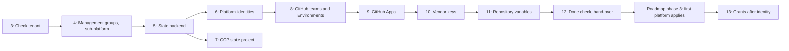

# 09 — Bootstrap (manual seed)

> Part of [spec v2](./README.md). The runbook for the manual seed: the only steps people do by hand before the pipeline takes over (N11). It expands [02 section 12](./02-architecture.md#12-bootstrap-manual-seed). All names follow [`03-naming-conventions.md`](./03-naming-conventions.md).

## 1. Scope

The seed creates the smallest set of privilege the pipeline needs to build everything else: the top management groups, the platform subscription, the state backend, the platform pipeline identities, and the accounts and keys of services that can't be created by code. Everything it creates is adopted into OpenTofu by the first platform applies (section 12), so nothing stays outside code.

The seed runs once, in a tenant and organization that hold none of the platform's resources ([ADR 0028](./adr/0028-platform-built-in-empty-tenant.md)). Steps marked **(proposed)** depend on a proposed ADR and change if that ADR changes.

Abbreviations used in this file:

| Abbreviation | Meaning |
|---|---|
| PIM | Entra Privileged Identity Management: roles are eligible and activated on demand |
| OIDC | OpenID Connect: GitHub Actions signs in to the cloud without a stored secret |
| WIF | Workload Identity Federation: the GCP side of OIDC |
| PAT | A GitHub personal access token |

## 2. Before you start

**People.** Each section below is one step and names who does it.

| Who | Holds | Sections |
|---|---|---|
| Tenant owner | Global Administrator through PIM, with "Access management for Azure resources" turned on for the session (Owner at `/`) | Sections 3–6 |
| Privileged Role Administrator (may be the tenant owner) | Can grant Microsoft Graph application permissions | Sections 6 and 13 |
| Billing account owner | Owner of "Trislab billing profile" | Sections 4 and 13 |
| GCP organization admin | Organization Administrator, Folder Creator, Billing Account User | Section 7 |
| GitHub organization owner | Owner of the GitHub organization | Sections 8, 9 and 11 |
| Platform admin | Access to the Cloudflare, Infracost and GHCR machine accounts | Section 10 |

**Tools:** `az` (with the `account` extension), `gcloud`, `gh`, `tofu`, `jq`.

**Values used below:**

| Placeholder | Value | Where it comes from |
|---|---|---|
| `<tenant>` | Entra tenant ID | `az account show --query tenantId` |
| `<ba>`, `<bp>` | Billing account and billing profile names of "Trislab billing profile" | `az billing account list`, `az billing profile list --account-name <ba>` |
| `<is>` | Name of the invoice section `is-platform` | `az billing invoice section list --account-name <ba> --profile-name <bp>` |
| `<org>` | GitHub organization | — |
| `<gcp-org>`, `<gcp-billing>` | GCP organization ID and billing account ID | `gcloud organizations list`, `gcloud billing accounts list` |
| `<nnnn>` | The platform's 4-digit suffix | Picked in section 5 |

### Order



## 3. Check the tenant

**Who:** tenant owner.

```sh
az account management-group list -o table        # only the Tenant Root Group
az account list --all -o table                   # no subscription other than those of other teams
gcloud resource-manager folders list --organization=<gcp-org>
gcloud projects list
```

**Check:** no management group other than the Tenant Root Group, no platform subscription, and no platform folder or project. If anything the platform would own exists, finish phase 0 of the roadmap first ([`10-roadmap.md`](./10-roadmap.md) section 3).

## 4. Management groups and `sub-platform`

**Who:** tenant owner, then billing account owner.

```sh
az account management-group create --name mg-root --display-name "Trislab"
az account management-group create --name mg-platform --display-name mg-platform --parent mg-root
```

The billing account owner checks that the invoice section `is-platform` exists ([ADR 0011](./adr/0011-one-invoice-with-a-section-per-owner.md)), then creates the subscription in it:

```sh
az billing invoice section list --account-name <ba> --profile-name <bp> -o table
az account alias create --name sub-platform --display-name sub-platform --workload Production \
  --billing-scope "/providers/Microsoft.Billing/billingAccounts/<ba>/billingProfiles/<bp>/invoiceSections/<is>"
```

The tenant owner moves it and registers the resource providers the platform uses:

```sh
SUB=$(az account alias show --name sub-platform --query properties.subscriptionId -o tsv)
az account management-group subscription add --name mg-platform --subscription "$SUB"
for p in Microsoft.Storage Microsoft.KeyVault Microsoft.Network Microsoft.OperationalInsights \
         Microsoft.Insights Microsoft.ManagedIdentity Microsoft.App Microsoft.PolicyInsights \
         Microsoft.Consumption Microsoft.CostManagement; do
  az provider register --namespace "$p" --subscription "$SUB"
done
```

**Check:** `az account management-group show --name mg-platform --expand` lists `sub-platform`.

## 5. State backend

**Who:** tenant owner.

The platform has one 4-digit suffix for all its globally unique names: `stplatformtfstate<nnnn>`, `kv-platform-<nnnn>`, `prj-platform-<nnnn>` and `gcs-platform-tfstate-<nnnn>` ([03 section 7.2](./03-naming-conventions.md#72-l1-platform-landing-zone)). It is picked here, not by `random_integer`, because the state storage that would hold it is itself named with it. It is stored as the repository variable `PLATFORM_SUFFIX` (section 11) and passed to every platform root.

```sh
NNNN=$(shuf -i 1000-9999 -n 1)
az storage account check-name --name "stplatformtfstate$NNNN"      # pick again if not available
TAGS="Product=platform Customer=trislab EnvironmentType=prod EnvironmentName=prod"
az group create -n rg-platform-state -l northeurope --subscription "$SUB" --tags $TAGS
az storage account create -n "stplatformtfstate$NNNN" -g rg-platform-state -l northeurope \
  --subscription "$SUB" --sku Standard_ZRS --kind StorageV2 --min-tls-version TLS1_2 \
  --allow-blob-public-access false --allow-shared-key-access false --tags $TAGS
az storage account blob-service-properties update -n "stplatformtfstate$NNNN" -g rg-platform-state \
  --subscription "$SUB" --enable-versioning true \
  --enable-delete-retention true --delete-retention-days 30 \
  --enable-container-delete-retention true --container-delete-retention-days 30
for c in tfstate-global tfstate-platform tfstate-lz tfstate-stamps; do
  az storage container-rm create --storage-account "stplatformtfstate$NNNN" -g rg-platform-state \
    --subscription "$SUB" -n "$c"
done
```

Shared key access is off, so every client signs in with Entra ID, and state locks are blob leases taken by the apply identities ([`08-pipeline.md`](./08-pipeline.md) section 7).

**Check:** `az storage container-rm list --storage-account stplatformtfstate<nnnn> -g rg-platform-state -o table` shows the four containers.

## 6. Platform pipeline identities (Azure)

**Who:** tenant owner; the Graph grants by a Privileged Role Administrator. The shell variables `SUB` and `NNNN` are from sections 4 and 5.

```sh
REPO="repo:<org>/tl-cloud-infrastructure"
for n in spn-platform-plan spn-platform-apply; do
  APP=$(az ad app create --display-name "$n" --query appId -o tsv)
  az ad sp create --id "$APP"
done
PLAN=$(az ad app list --display-name spn-platform-plan --query [0].appId -o tsv)
APPLY=$(az ad app list --display-name spn-platform-apply --query [0].appId -o tsv)

fic() { az ad app federated-credential create --id "$1" --parameters \
  "{\"name\":\"$2\",\"issuer\":\"https://token.actions.githubusercontent.com\",\"subject\":\"$3\",\"audiences\":[\"api://AzureADTokenExchange\"]}"; }
fic "$PLAN"  pull-request "$REPO:pull_request"
fic "$PLAN"  main         "$REPO:ref:refs/heads/main"
fic "$APPLY" platform     "$REPO:environment:platform"
```

Role assignments come from [02 section 6](./02-architecture.md#6-identity-and-access), with the `mg-root` rights of **(proposed)** [ADR 0034](./adr/0034-platform-apply-identity-rights.md) and the state rights of **(proposed)** [ADR 0032](./adr/0032-state-access-by-layer-and-path.md):

| Identity | Role | Scope |
|---|---|---|
| `spn-platform-plan` | Reader | `mg-root` |
| `spn-platform-plan` | Storage Blob Data Reader | Container `tfstate-platform` |
| `spn-platform-apply` | Owner | `mg-platform` |
| `spn-platform-apply` | Management Group Contributor, Resource Policy Contributor, User Access Administrator | `mg-root` |
| `spn-platform-apply` | Storage Blob Data Contributor | Container `tfstate-platform` |

```sh
MGROOT=/providers/Microsoft.Management/managementGroups/mg-root
MGPLAT=/providers/Microsoft.Management/managementGroups/mg-platform
CONT=$(az storage account show -n "stplatformtfstate$NNNN" -g rg-platform-state --subscription "$SUB" --query id -o tsv)/blobServices/default/containers/tfstate-platform
ra() { az role assignment create --assignee "$1" --role "$2" --scope "$3"; }
ra "$PLAN"  "Reader" "$MGROOT"
ra "$PLAN"  "Storage Blob Data Reader" "$CONT"
ra "$APPLY" "Owner" "$MGPLAT"
ra "$APPLY" "Management Group Contributor" "$MGROOT"
ra "$APPLY" "Resource Policy Contributor" "$MGROOT"
ra "$APPLY" "User Access Administrator" "$MGROOT"
ra "$APPLY" "Storage Blob Data Contributor" "$CONT"
```

So that `platform/azure/identity` can adopt both app registrations, `spn-platform-apply` becomes an owner of each:

```sh
APPLY_OID=$(az ad sp show --id "$APPLY" --query id -o tsv)
az ad app owner add --id "$PLAN"  --owner-object-id "$APPLY_OID"
az ad app owner add --id "$APPLY" --owner-object-id "$APPLY_OID"
```

Microsoft Graph application permissions, granted by a Privileged Role Administrator:

| Identity | Permission | Why |
|---|---|---|
| `spn-platform-plan` | `Application.Read.All`, `Group.Read.All` | Plans of `platform/azure/identity` read app registrations and groups |
| `spn-platform-apply` | `Application.ReadWrite.OwnedBy`, `Group.Create` **(proposed, ADR 0034)** | Creates the other pipeline identities and the Entra groups |

```sh
GRAPH=00000003-0000-0000-c000-000000000000
role() { az ad sp show --id $GRAPH --query "appRoles[?value=='$1'].id" -o tsv; }
az ad app permission add --id "$PLAN"  --api $GRAPH --api-permissions "$(role Application.Read.All)=Role" "$(role Group.Read.All)=Role"
az ad app permission add --id "$APPLY" --api $GRAPH --api-permissions "$(role Application.ReadWrite.OwnedBy)=Role" "$(role Group.Create)=Role"
az ad app permission admin-consent --id "$PLAN"
az ad app permission admin-consent --id "$APPLY"
```

**Check:** `az role assignment list --assignee "$APPLY" --all -o table` shows the five rows above. The tenant owner then turns off "Access management for Azure resources" again.

## 7. GCP state project (proposed)

**Who:** GCP organization admin. Built now because of **(proposed)** [ADR 0033](./adr/0033-gcp-state-storage-built-first.md); the rest of GCP waits for the first GCP customer ([ADR 0008](./adr/0008-gcp-built-on-first-customer.md)).

```sh
gcloud resource-manager folders create --display-name=fldr-platform --organization=<gcp-org>
FLDR=$(gcloud resource-manager folders list --organization=<gcp-org> --filter="displayName=fldr-platform" --format="value(name)")
PRJ=prj-platform-$NNNN
gcloud projects create "$PRJ" --folder="$FLDR" \
  --labels=product=platform,customer=trislab,environment_type=prod,environment_name=prod
gcloud billing projects link "$PRJ" --billing-account=<gcp-billing>
gcloud services enable storage.googleapis.com iam.googleapis.com iamcredentials.googleapis.com \
  sts.googleapis.com storagetransfer.googleapis.com --project="$PRJ"
gcloud storage buckets create "gs://gcs-platform-tfstate-$NNNN" --project="$PRJ" --location=europe-west8 \
  --uniform-bucket-level-access --public-access-prevention
gcloud storage buckets update "gs://gcs-platform-tfstate-$NNNN" --versioning

gcloud iam workload-identity-pools create wif-github --project="$PRJ" --location=global
gcloud iam workload-identity-pools providers create-oidc github --project="$PRJ" --location=global \
  --workload-identity-pool=wif-github --issuer-uri=https://token.actions.githubusercontent.com \
  --attribute-mapping=google.subject=assertion.sub,attribute.repository=assertion.repository \
  --attribute-condition="assertion.repository=='<org>/tl-cloud-infrastructure'"
for n in sa-platform-plan sa-platform-apply; do
  gcloud iam service-accounts create "$n" --project="$PRJ"
done
```

| Service account | Trusts (WIF subject) | Bucket role |
|---|---|---|
| `sa-platform-plan` | `repo:<org>/tl-cloud-infrastructure:pull_request` and `…:ref:refs/heads/main` | Storage Object Viewer |
| `sa-platform-apply` | `repo:<org>/tl-cloud-infrastructure:environment:platform` | Storage Object Admin |

Each trust is a `roles/iam.workloadIdentityUser` binding on the service account for `principal://iam.googleapis.com/projects/<project number>/locations/global/workloadIdentityPools/wif-github/subject/<subject>`.

**Check:** `gcloud storage buckets describe gs://gcs-platform-tfstate-<nnnn>` shows versioning on and public access prevention enforced.

## 8. GitHub teams and layer Environments (proposed)

**Who:** GitHub organization owner. The teams and reviewers are from **(proposed)** [ADR 0031](./adr/0031-environment-reviewers-and-layer-environments.md).

1. Create the teams `platform-admins`, `devops` and `regulated-admins`, with the same members as `grp-platform-admins`, `grp-devops` and `grp-regulated-admins`.
2. Create the Environments `platform`, `global` and `landingzones` in `tl-cloud-infrastructure`, each with `platform-admins` as required reviewers and self-review prevented:

   ```sh
   TEAM=$(gh api orgs/<org>/teams/platform-admins --jq .id)
   for e in platform global landingzones; do
     gh api -X PUT "repos/<org>/tl-cloud-infrastructure/environments/$e" --input - <<EOF
   {"reviewers":[{"type":"Team","id":$TEAM}],"prevent_self_review":true}
   EOF
   done
   ```

3. Add an organization ruleset on `main` of `tl-cloud-infrastructure`: pull request required, one approval, CODEOWNERS review, no force push, no deletion. The required status checks are added in roadmap phase 2, once the workflows that report them exist ([`08-pipeline.md`](./08-pipeline.md) section 4).

**Check:** `gh api repos/<org>/tl-cloud-infrastructure/environments --jq '.environments[].name'` lists the three.

## 9. GitHub Apps

**Who:** GitHub organization owner.

Create three GitHub Apps owned by the organization, with no webhook, installed only on `tl-cloud-infrastructure` ([ADR 0019](./adr/0019-github-app-for-landing-zone-environments.md), [ADR 0026](./adr/0026-vendor-credentials-through-lz-environment.md)):

| App | Repository permissions | App ID stored as | Private key stored as |
|---|---|---|---|
| `tl-landingzones-apply` | Administration: read and write; Environments: read and write; Metadata: read | Variable `LZ_APP_ID` in `landingzones` | Secret `LZ_APP_KEY` in `landingzones` |
| `tl-landingzones-plan` | Administration: read; Environments: read; Metadata: read | Repository variable `LZ_PLAN_APP_ID` | Repository secret `LZ_PLAN_APP_KEY` |
| `tl-global-apply` | Environments: read and write; Secrets: read and write; Metadata: read | Variable `GLOBAL_APP_ID` in `global` | Secret `GLOBAL_APP_KEY` in `global` |

Delete the downloaded key files once stored. The keys are rotated by hand.

## 10. Vendor keys

**Who:** platform admin.

| Key | How | Stored as |
|---|---|---|
| Cloudflare read-only token | Cloudflare account → API tokens, account-scoped, read on zones, DNS, WAF and Access | Repository secret `CLOUDFLARE_API_TOKEN_PLAN` |
| Cloudflare edit token | The same resources with edit, plus zone creation on the account | Secret `CLOUDFLARE_API_TOKEN` in `global` |
| GHCR pull token | A machine user in the GitHub organization with read access to the image packages, and a classic PAT with `read:packages` only | Secret `GHCR_PULL_TOKEN` in `landingzones` ([ADR 0026](./adr/0026-vendor-credentials-through-lz-environment.md)) |
| Infracost API key | Infracost account of the platform team | Repository secret `INFRACOST_API_KEY` |

Neon and Upstash accounts and keys are created when the first stamp uses them, not in the seed. Their keys are stored as in [`08-pipeline.md`](./08-pipeline.md) section 9.

## 11. Repository variables

**Who:** GitHub organization owner.

| Variable | Value | Where |
|---|---|---|
| `AZURE_TENANT_ID` | `<tenant>` | Repository |
| `PLATFORM_SUFFIX` | `<nnnn>` | Repository |
| `STATE_ACCOUNT` | `stplatformtfstate<nnnn>` | Repository |
| `PLATFORM_SUBSCRIPTION_ID` | ID of `sub-platform` | Repository |
| `AZURE_CLIENT_ID_PLATFORM_PLAN` | App ID of `spn-platform-plan` | Repository |
| `AZURE_CLIENT_ID_PLATFORM_APPLY` | App ID of `spn-platform-apply` | Environment `platform` |
| `GCP_WIF_PROVIDER` | `projects/<project number>/locations/global/workloadIdentityPools/wif-github/providers/github` | Repository |
| `GCP_SA_PLATFORM_PLAN` | E-mail of `sa-platform-plan` | Repository |
| `GCP_SA_PLATFORM_APPLY` | E-mail of `sa-platform-apply` | Environment `platform` |
| `ITOP_GATE` | `off` ([ADR 0029](./adr/0029-environment-approval-gate-until-itop.md)) | Repository |

The client IDs of the other layer identities are added by the PR that creates them in `platform/azure/identity` (section 13).

## 12. Done check and hand-over

| Check | Expected |
|---|---|
| Management groups | `mg-root` → `mg-platform` → `sub-platform` |
| State | `stplatformtfstate<nnnn>` with four empty containers, versioning and soft delete on |
| Identities | `spn-platform-plan`, `spn-platform-apply` with the federated credentials and roles of section 6 |
| GCP **(proposed)** | `prj-platform-<nnnn>` with `gcs-platform-tfstate-<nnnn>`, `wif-github`, the two service accounts |
| GitHub | The three teams, three Environments, three Apps, the ruleset, all secrets and variables above |

From here, everything goes through pull requests. The first platform PRs adopt the seed with `import` blocks, so the plan shows "import" and no "create" for these resources ([`10-roadmap.md`](./10-roadmap.md) section 6):

| Root | Imports |
|---|---|
| `platform/azure/state` | `rg-platform-state`, the storage account, its blob service settings, the four containers, and the state role assignments of section 6 |
| `platform/azure/identity` | The two app registrations, their service principals, federated credentials and owners |
| `platform/azure/governance` | `mg-root`, `mg-platform`, the subscription's placement, and the `mg-root` and `mg-platform` role assignments of section 6 |
| `platform/gcp/identity`, `platform/gcp/state` **(proposed)** | The folder, the project, the bucket, the pool, the provider and the two service accounts |

## 13. Grants after `platform/azure/identity`

Once the first `platform/azure/identity` apply has created `spn-landingzones-apply`, two rights are granted by hand, once, and are never repeated per apply:

| Who | Grant | Why |
|---|---|---|
| Billing account owner | **Billing profile contributor** on "Trislab billing profile" to `spn-landingzones-apply` | Creates invoice sections and subscriptions ([ADR 0011](./adr/0011-one-invoice-with-a-section-per-owner.md)) |
| Privileged Role Administrator | Microsoft Graph `Application.ReadWrite.OwnedBy` to `spn-landingzones-apply` **(proposed, ADR 0034)** | Creates each landing zone's plan and deploy identities |

```sh
LZ=$(az ad sp list --display-name spn-landingzones-apply --query [0].id -o tsv)
ROLE=$(az rest --method get \
  --url "https://management.azure.com/providers/Microsoft.Billing/billingAccounts/<ba>/billingProfiles/<bp>/billingRoleDefinitions?api-version=2024-04-01" \
  --query "value[?properties.roleName=='Billing profile contributor'].id" -o tsv)
az rest --method put \
  --url "https://management.azure.com/providers/Microsoft.Billing/billingAccounts/<ba>/billingProfiles/<bp>/billingRoleAssignments/$(uuidgen)?api-version=2024-04-01" \
  --body "{\"properties\":{\"principalId\":\"$LZ\",\"principalTenantId\":\"<tenant>\",\"roleDefinitionId\":\"$ROLE\"}}"
```

**Check:** the billing profile's access control in the portal lists `spn-landingzones-apply` as Billing profile contributor. From then on, the `landing-zone` module takes over for landing zones ([05](./05-landing-zones.md)).
