# 10 — Roadmap

> Part of [spec v2](./README.md). The build order of the platform, from an empty tenant to the first customer, and what follows. Each phase has a goal, what must be true before it starts, the pull requests or manual work it contains, and the check that ends it. All names follow [`03-naming-conventions.md`](./03-naming-conventions.md).

## 1. Scope

The platform is built in phases. A phase starts only when the one before it has passed its exit check. Within a phase, the PRs are applied in the order listed, each through the pipeline ([`08-pipeline.md`](./08-pipeline.md)), except for phases 0 and 1, which are manual.

Two pilots prove the design end to end before any real workload moves:

| Pilot | Owner | Landing zones | Stamps | App |
|---|---|---|---|---|
| Product pilot | Trislab products (`shr`) | `products-sandbox-neu`, `products-prod-neu` | `shr-web-staging`, `shr-web-prod` | `website-trislab`, built from the app template |
| Customer pilot | Astra Group (`asg`) | `cust-asg-sandbox-neu`, `cust-asg-prod-neu` | `asg-con-dev`, `asg-con-test`, `asg-con-prod` | The app template's sample app, as `construction` |

Neither pilot needs managed PostgreSQL, Neon or Upstash, so open questions 7 and 8 don't block them ([`TODO.md`](./TODO.md#open-questions)).

## 2. Phases at a glance

```mermaid
flowchart LR
  P0["0: Clear tenant"] --> P1["1: Seed"]
  P1 --> P2["2: Pipeline"]
  P2 --> P3["3: Platform LZ"]
  P3 --> P4["4: landing-zone module"]
  P4 --> P5["5: Global edge"]
  P5 --> P6["6: aca-app"]
  P6 --> P7["7: App template"]
  P7 --> P8["8: Product pilot"]
  P8 --> P9["9: Customer pilot"]
  P9 --> P10["10: Operations"]
  P10 --> P11["11+: Platform apps and growth"]
```

| # | Phase | Result | Section |
|---|---|---|---|
| 0 | Clear the tenant | Nothing of the platform's old resources is left | 3 |
| 1 | Seed | `mg-root`, `sub-platform`, state, platform identities, GitHub setup | 4 |
| 2 | Pipeline | Plan, apply and drift work for `platform/**` | 5 |
| 3 | Platform landing zone | Hierarchy, policy, identities, management, hub | 6 |
| 4 | `landing-zone` module | `products-sandbox-neu` created from one file | 7 |
| 5 | Global edge | `trislab.com` in Cloudflare and Azure DNS, Zero Trust on sandbox | 8 |
| 6 | First stamp template | `aca-app` v1; `shr-web-staging` answers behind Zero Trust | 9 |
| 7 | App template | `tl-template-aca-app`; the `website-trislab` app repository deploys by digest | 10 |
| 8 | Product pilot | `shr-web-prod` live, promoted from staging, with the Front Door mirror | 11 |
| 9 | Customer pilot | Astra Group's dev, test and prod, with guest access and their own invoice section | 12 |
| 10 | Operations | Template rollout by ring, PR previews, clean-up job | 13 |
| 11+ | Platform apps and growth | iTop, observability, security, Backstage; more templates, data services, customers, GCP | 14 |

## 3. Phase 0: Clear the tenant

**Goal:** the tenant, the GCP organization and the repository hold nothing of the resources the platform replaces ([ADR 0028](./adr/0028-platform-built-in-empty-tenant.md)).

**Entry:** this spec is merged to `main`.

| # | Work | Who |
|---|---|---|
| 1 | Disable the old workflows and remove their required checks | Repository admin |
| 2 | Move `sub-tl-shared-infra-azure` to the Tenant Root Group, then `tofu destroy` the two old roots locally | Tenant owner, GCP organization admin |
| 3 | Delete the old app registrations and the group `Trislab-DevOps` | Tenant owner |
| 4 | Delete the old state backend, and the old GCP service accounts, pool, bucket and project | Tenant owner, GCP organization admin |
| 5 | Cancel `sub-tl-shared-infra-azure` | Billing account owner |
| 6 | Delete the old GitHub Environments, variables and secrets | Repository admin |
| 7 | One PR that deletes `shared-infrastructure/`, the old workflows and the documents outside `docs/spec/v2/` | Platform admin |

The full list of resources is in ADR 0028.

**Exit:** section 3 of [`09-bootstrap.md`](./09-bootstrap.md#3-check-the-tenant) passes.

## 4. Phase 1: Seed

**Goal:** the smallest set of privilege the pipeline needs.

**Entry:** phase 0 done. The invoice section is renamed to `is-platform` ([ADR 0011](./adr/0011-one-invoice-with-a-section-per-owner.md)).

**Work:** [`09-bootstrap.md`](./09-bootstrap.md) sections 3–12, all manual.

**Exit:** the done check in [09 section 12](./09-bootstrap.md#12-done-check-and-hand-over) passes.

**Covers:** N2, N10, N11.

## 5. Phase 2: Pipeline

**Goal:** a PR that touches `platform/**` is planned, checked, applied before merge and checked for drift every night.

**Entry:** phase 1 done.

| # | PR | Contents |
|---|---|---|
| 1 | Pipeline | `tofu-plan.yml`, `tofu-apply.yml`, `tofu-drift.yml`, `prowler-iac-scan.yml`, the detect script, reusable plan and apply workflows, `CODEOWNERS` ([`08-pipeline.md`](./08-pipeline.md) sections 2–8) |
| 2 | Policy | `policy/naming.rego`, `tags.rego`, `regions.rego`, `catalog.rego`, with their tests ([03 section 11](./03-naming-conventions.md#11-enforcement), [07 section 7](./07-catalog-and-ipam.md#7-checks-before-apply)) |
| 3 | Ruleset | Add the required checks `plan`, `conftest`, `prowler` and `applied` to the `main` ruleset (a repository admin, once PR 1 is merged) |

**Exit:** an empty test root under `platform/azure/` is planned, applied after approval, merged, and shows no drift the next night. The test root is then removed.

**Covers:** N1 (except the iTop gate, [ADR 0029](./adr/0029-environment-approval-gate-until-itop.md)), N3.

## 6. Phase 3: Platform landing zone

**Goal:** everything a landing zone needs from the platform exists ([05 section 1](./05-landing-zones.md#1-scope)).

**Entry:** phase 2 done.

| # | PR | Root | Creates |
|---|---|---|---|
| 1 | State | `platform/azure/state` | Imports the seed's state storage and its role assignments ([09 section 12](./09-bootstrap.md#12-done-check-and-hand-over)). |
| 2 | Governance | `platform/azure/governance` | Imports `mg-root` and `mg-platform`. Creates `mg-landingzones`, `mg-lz-prod`, `mg-lz-prod-regulated`, `mg-lz-sandbox`, `mg-experiments`, `mg-decommissioned`, the policy assignments per scope ([02 section 2](./02-architecture.md#policy-assignment-by-scope)), the custom roles "Stamp app deploy" and "Edge stamp reader", and `ag-finops` |
| 3 | Identity | `platform/azure/identity` | Imports the seed identities. Creates, with their roles on the management groups of PR 2, `spn-global-plan`/`-apply`, `spn-landingzones-plan`/`-apply`, the groups `grp-devops`, `grp-platform-admins`, `grp-regulated-admins`, and PIM eligibility. A repository admin adds the new client IDs as variables ([08 section 9](./08-pipeline.md#9-credentials-in-the-repository)) |
| 4 | Grants | — | [09 section 13](./09-bootstrap.md#13-grants-after-platformazureidentity): billing profile contributor and Graph permission for `spn-landingzones-apply` (manual) |
| 5 | Management | `platform/azure/management` | `log-platform` (14 days), `kv-platform-<nnnn>` with the break-glass credential, platform alerts to Slack |
| 6 | Connectivity | `platform/azure/connectivity`, `catalog/ipam.yaml` | `rg-hub-neu`, `vnet-hub-neu` (`10.0.0.0/20`) with an empty `GatewaySubnet`, `rg-platform-dns`, and the custom roles "Landing zone hub peering" and "Landing zone DNS link" ([ADR 0018](./adr/0018-hub-peering-custom-role.md), [ADR 0020](./adr/0020-landing-zone-links-private-dns-zones.md)). No VPN gateway |
| 7 | GCP state (proposed) | `platform/gcp/identity`, `platform/gcp/state` | Imports the GCP seed. Adds the nightly state copy ([ADR 0033](./adr/0033-gcp-state-storage-built-first.md)) |
| 8 | State rights | `platform/azure/state` | The container rights of the identities from PR 3, and the `tfstate-stamps` grant right for `spn-landingzones-apply` ([08 section 7](./08-pipeline.md#7-state-access), proposed [ADR 0032](./adr/0032-state-access-by-layer-and-path.md)) |

**Exit:** a test resource without the mandatory tags is denied in `sub-platform`. A test resource in a region outside N6 is denied. The nightly drift run shows no differences for all platform roots. The state copy is in GCS.

**Covers:** N4 (policy), N5 (tags), N6, N8 (central workspace), N10, N12 (`sub-platform` collapse).

## 7. Phase 4: `landing-zone` module

**Goal:** a landing zone is created from one file ([05](./05-landing-zones.md)).

**Entry:** phase 3 done, including the grants in PR 4.

| # | PR | Repository and root | Creates |
|---|---|---|---|
| 1 | Module | `tl-platform` (new repository) | `landing-zone` v0.1.0, Azure half only ([05 section 4](./05-landing-zones.md#4-what-one-apply-creates)). Released as a git tag |
| 2 | Root | `landing-zones/_root` | The root that calls the module once per `lz.yaml` ([04](./04-repository-structure.md)) |
| 3 | First landing zone | `landing-zones/products-sandbox-neu.yaml`, `catalog/ipam.yaml` | `is-products`, `sub-products-sandbox-neu` in `mg-lz-sandbox`, spoke `10.32.0.0/20` peered with `vnet-hub-neu`, Key Vault, budget, `spn-lz-products-sandbox-neu-plan`/`-deploy`, the Environment `lz-products-sandbox-neu` |

**Exit:** the landing zone's Environment exists with its reviewers, both halves of the peering are connected, the budget alerts through `ag-finops`, and a test stamp PR under `stamps/products-sandbox-neu/` gets as far as a plan with `spn-lz-products-sandbox-neu-plan`.

**Covers:** F6 (sandbox type), N3 (per-landing-zone identity), N4 (subscription per owner), N5 (budget, invoice section), N12.

## 8. Phase 5: Global edge

**Goal:** Trislab's domain is served by Cloudflare and Azure DNS, and every sandbox hostname is behind Zero Trust.

**Entry:** phase 4 done.

| # | PR | Root | Creates |
|---|---|---|---|
| 1 | Zones | `global/edge`, `catalog/tenants.yaml` (`domains`) | The `trislab.com` zone in Cloudflare and Azure DNS, in `rg-global-edge`. **Every existing record** of the domain (mail, other sites) is written into the zone first, so the delegation changes nothing that runs today |
| 2 | Delegation | — | Both nameserver sets are listed at the registrar (manual, the one step N11 allows) |
| 3 | Edge rules | `global/edge` | The WAF rules and the Cloudflare Access wildcard policy on sandbox hostnames ([07 section 3](./07-catalog-and-ipam.md#3-hostname-rules)) |
| 4 | Registry | `global/registry` | GHCR organization settings, and the public image `ghcr.io/<org>/platform-placeholder` |

**Exit:** `dig NS trislab.com` returns both nameserver sets. Existing services on the domain still work. A test hostname under a sandbox stamp's name asks for Zero Trust sign-in.

**Covers:** F8 (Trislab's zone), N7 (dual DNS, Zero Trust), N9 (GHCR).

## 9. Phase 6: First stamp template

**Goal:** `aca-app` v1 builds a stamp from one `stamp.yaml` ([06](./06-stamp-templates.md)).

**Entry:** phase 5 done.

| # | PR | Repository and root | Creates |
|---|---|---|---|
| 1 | Template | `tl-platform` | `stamps/aca-app` v1.0.0 with the building blocks `stamp-network`, `kv-secret-access`, `app-deploy-identity` and `hostname-bindings`; its JSON schema; the `main.tf` generator |
| 2 | Stamp check | `.github/workflows/stamp-check.yml` | The checks in [06 section 4](./06-stamp-templates.md#4-checks-before-apply) |
| 3 | First stamp | `stamps/products-sandbox-neu/website-trislab-staging/`, `catalog/` | `shr-web-staging` with the placeholder image and the hostname `staging.new.trislab.com`, in three applies: stamp, `global`, stamp again ([08 section 6](./08-pipeline.md#6-order-of-applies)) |

**To check in this phase** (from the ADRs):
- whether the tag deny policy blocks `rg-shr-web-staging-infra`, and add the exemption if it does ([06 section 6.1](./06-stamp-templates.md#61-what-one-apply-creates));
- that the `asuid` lookup of a name that doesn't exist returns an empty result, whether Container Apps issues a managed certificate behind the Cloudflare proxy, and whether the verification ID is the same for every environment in a subscription ([ADR 0027](./adr/0027-global-edge-writes-stamp-dns-records.md));
- that ephemeral input variables work with a saved plan, and which permissions `tl-global-apply` needs ([ADR 0026](./adr/0026-vendor-credentials-through-lz-environment.md)).

**Exit:** `https://staging.new.trislab.com` shows the placeholder after Zero Trust sign-in. The stamp's NSG has the sandbox/production deny rules ([ADR 0025](./adr/0025-stamp-nsg-carries-isolation-rules.md)). A second plan shows no changes.

**Covers:** F3 (`tenancy`), F4 (container apps), N4 (network isolation), N7 (Cloudflare-only ingress).

## 10. Phase 7: App template

**Goal:** an app repository builds once and deploys by digest, within the stamp's caps (F7, F9).

**Entry:** phase 6 done.

| # | Work | Repository | Contents |
|---|---|---|---|
| 1 | Template | `tl-template-aca-app` (new) | A sample app, Dockerfile, `platform.yaml` with its schema, CI that builds, scans with Trivy, pushes to GHCR, checks `platform.yaml` against the `SizingCaps` tag, and deploys the digest with the app-deploy identity; the promotion workflow |
| 2 | App repository | `website-trislab` (new, from the template) | GitHub Environments `staging` and `prod`, with the app-deploy identity's client ID from the stamp's output `appdeploy_client_id` ([06 section 10](./06-stamp-templates.md#10-lifecycle)) |

**Exit:** a push to `website-trislab`'s default branch deploys to `shr-web-staging` by digest. A `platform.yaml` above the caps fails CI before deploying. The stamp's nightly drift plan stays clean after the deploy.

**Covers:** F7, F9, N9 (image scan).

## 11. Phase 8: Product pilot

**Goal:** a Trislab product runs in production, promoted from sandbox, with the edge failover in place.

**Entry:** phase 7 done.

| # | PR | Root | Creates |
|---|---|---|---|
| 1 | Prod landing zone | `landing-zones/products-prod-neu.yaml`, `catalog/ipam.yaml` | `sub-products-prod-neu` in `mg-lz-prod`, spoke `10.16.0.0/20`, the Environment `lz-products-prod-neu` |
| 2 | Prod stamp | `stamps/products-prod-neu/website-trislab/`, `catalog/` | `shr-web-prod`, with the hostname `new.trislab.com` |
| 3 | Front Door | `global/edge` (`front-door.tf`) | `afd-global` mirroring `shr-web-prod`'s origin |

The website keeps its current hosting until the new one is accepted. Then a catalog PR moves `trislab.com` and `www.trislab.com` to `shr-web-prod` ([07 section 8](./07-catalog-and-ipam.md#8-changing-the-catalog)).

**Exit:** a release promotes the digest from `staging` to `prod` after the Environment approval. A rollback promotes the previous digest. `new.trislab.com` is also served through `afd-global`'s endpoint, and Azure DNS answers for it. No traffic passes between `products-sandbox-neu` and `products-prod-neu`.

**Covers:** F1, F6 (prod type), F7 (promotion, rollback), N4 (sandbox ↔ prod), N7 (Front Door mirror).

## 12. Phase 9: Customer pilot

**Goal:** a customer is onboarded as in [02 section 11](./02-architecture.md#11-key-scenarios), with dev, test and prod, its own domain, guest access and its own invoice section.

**Entry:** phase 8 done. Astra Group has agreed to the pilot and will delegate their domain's nameservers.

| # | PR | Roots | Creates |
|---|---|---|---|
| 1 | Admin group | `platform/azure/identity` | `grp-cust-asg-admins` with Astra Group's IT admins as B2B guests (proposed [ADR 0034](./adr/0034-platform-apply-identity-rights.md)) |
| 2 | Landing zones and domain | `landing-zones/cust-asg-sandbox-neu.yaml`, `cust-asg-prod-neu.yaml`, `catalog/ipam.yaml`, `catalog/tenants.yaml` (`domains`) | `is-cust-asg`, both subscriptions and spokes (`10.32.32.0/20`, `10.16.32.0/20`), budgets with Astra Group's extra recipient, Reader for `grp-cust-asg-admins`; the customer's zone in `global/edge` |
| 3 | Delegation | — | Astra Group lists both nameserver sets at their registrar |
| 4 | Sandbox stamps | `stamps/cust-asg-sandbox-neu/construction-dev/`, `construction-test/`, `catalog/` | `asg-con-dev` and `asg-con-test`, dedicated, on `dev.` and `test.` of the customer's domain |
| 5 | Prod stamp | `stamps/cust-asg-prod-neu/construction/`, `catalog/` | `asg-con-prod` on the customer's domain root |
| 6 | App repository | From `tl-template-aca-app` | The sample app as `construction`, with Environments `dev`, `test`, `prod` |

**Exit:** a push deploys to dev, a release tag to test, and an approved promotion to prod (F7). An Astra Group admin can read their two subscriptions and nothing else. The invoice shows `is-cust-asg` with both subscriptions. Astra Group's stamps can't reach the products landing zones, and the reverse.

**Covers:** F2, F6 (customer dev → test → prod), F8 (customer domain), F12 (guest admins), N4 (customer isolation), N5 (invoice section per customer).

## 13. Phase 10: Operations

**Goal:** the platform changes safely without manual work.

**Entry:** phase 9 done.

| # | Work | Contents |
|---|---|---|
| 1 | Rollout rings | `renovate.json`; release `aca-app` v1.1.0 and roll it through rings 0–3 ([ADR 0009](./adr/0009-ring-based-template-rollout.md)) |
| 2 | Ephemeral stamps | PR previews for `website-trislab` (`shr-web-pr<n>`, with a `ttl`), and `scheduled-cleanup.yml` ([06 section 9](./06-stamp-templates.md#9-ephemeral-stamps)) |

**Exit:** a template release reaches every pilot stamp ring by ring, stopping on a failure. A PR preview is created and destroyed by the pipeline, and its range is free again.

**Covers:** F6 (ephemeral environments), N12.

## 14. Phase 11 and later

These phases get their detailed steps when they start. The order of the first four is fixed. The rest start when a product or customer needs them.

| # | Phase | Starts | Notes |
|---|---|---|---|
| 11 | iTop | After phase 10 | `platform/apps/itop` staging and prod. Then `ITOP_GATE` is turned on ([ADR 0029](./adr/0029-environment-approval-gate-until-itop.md)) |
| 12 | Observability | After iTop | Prometheus, Grafana, Loki; stamp metrics and logs; Slack alerts (N8) |
| 13 | Security | After observability | Trivy server and Dependency-Track; SBOMs from app CI (N9) |
| 14 | Backstage | After security | Developer portal for sandbox only, `id-backstage` (F10) |
| — | Neon and Upstash | The first stamp that needs a database or cache | `global/external-providers`, `db-neon`, `cache-upstash`; open question 8 first |
| — | Managed PostgreSQL and private endpoints | The first stamp that needs `db-postgres`, e.g. `vbs-con-prod` | Open question 7 first |
| — | More customers | Each onboarding | Okna Capris, VBS Lawyers (regulated) as in phase 9 |
| — | `aks-app`, `functions-app` | Okna Capris's ERP and reporting service | [06 section 11](./06-stamp-templates.md#11-other-templates) |
| — | GCP | Rehabo, the first GCP customer | The rest of `platform/gcp`, `cloudrun-app` ([ADR 0008](./adr/0008-gcp-built-on-first-customer.md)) |
| — | A new region | A product that needs it | [05 section 5](./05-landing-zones.md#5-adding-a-region); open question 6 first |
| — | Split `sub-platform` | When the platform outgrows one subscription | [02 section 2](./02-architecture.md#collapse-and-growth) |

## 15. Requirement coverage by phase

| Requirement | First proven in phase |
|---|---|
| F1 Trislab products | 8 |
| F2 Customer deployments | 9 |
| F3 Shared or dedicated from the same code | 6 (dedicated); the first shared stamp with its first tenants |
| F4 Archetypes and data | 6 (container apps); later phases for AKS, functions and data |
| F5 Multi-cloud | GCP phase |
| F6 Environments | 4, 8, 9, 10 |
| F7 Build once, promote | 7, 8, 9 |
| F8 Customer domains | 5, 9 |
| F9 Developers don't create infrastructure | 7 |
| F10 Self-service sandbox | 14 |
| F11 Graduation | The first graduated product |
| F12 Customer admins, regulated customers | 9 (guests); VBS Lawyers for regulated |
| F13 Platform apps | 11–14 |
| N1 PR pipeline with gates | 2; iTop gate in 11 |
| N2 No long-lived secrets | 1 |
| N3 Least privilege | 2, 4 |
| N4 Isolation | 3, 6, 8, 9 |
| N5 FinOps | 3, 4, 9 |
| N6 EU regions | 3 |
| N7 Edge without a single point of failure | 5, 8 |
| N8 Central observability | 3 (logs); 12 (metrics) |
| N9 Supply chain | 5, 7; 13 |
| N10 State | 1, 3 |
| N11 Manual only for the seed | 1 |
| N12 Grow by adding instances | 3, 4, 10 |

## 16. Decisions and open questions

| Item | Affects | Status |
|---|---|---|
| [ADR 0028](./adr/0028-platform-built-in-empty-tenant.md): the platform is built in an empty tenant | Section 3 | accepted |
| [ADR 0029](./adr/0029-environment-approval-gate-until-itop.md): Environment approval is the only gate until iTop runs | Sections 5 and 14 | accepted |
| [ADR 0032](./adr/0032-state-access-by-layer-and-path.md), [ADR 0033](./adr/0033-gcp-state-storage-built-first.md), [ADR 0034](./adr/0034-platform-apply-identity-rights.md) | Sections 6 and 12 | proposed |
| Open questions 6, 7 and 8 | Section 14 | deferred |

The questions are tracked in [`TODO.md`](./TODO.md#open-questions).
