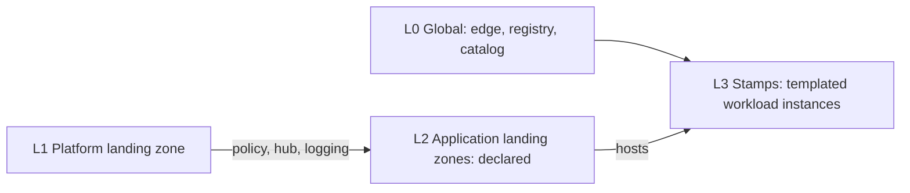

# Trislab Cloud Platform — Specification v2

This folder is the specification for Trislab's multi-cloud (Azure primary, GCP optional) hosting platform. It hosts Trislab's own SaaS products and dedicated per-customer deployments. Everything is provisioned with OpenTofu through reviewed pull requests.

## The model in one paragraph

The platform follows the **Cloud Adoption Framework landing zone** model and the **Deployment Stamps** pattern, as two separate layers. The *landing zones* are the governed plots: management hierarchy, policy, identity, hub network, logging, budgets. They are owned by the platform team, few in number and rarely changed. The *stamps* are the prefab houses placed on those plots: each is one instance of a versioned workload template (compute, apps, data, DNS). They are owned by workload teams, many in number and changed often. Stamps are deployed into landing zones and inherit their policy, networking and logging. A global edge layer (Cloudflare, registry, tenant catalog) sits in front of everything.

## Documents

| File | Contents |
|---|---|
| [`01-requirements.md`](./01-requirements.md) | Functional and non-functional requirements the architecture must satisfy |
| [`02-architecture.md`](./02-architecture.md) | Target architecture: layers, governance hierarchy, network, stamps, identity, repository layout, delivery flows, cross-cutting concerns, requirement coverage |
| [`03-naming-conventions.md`](./03-naming-conventions.md) | Names for every layer, owner codes, globally unique names, tags and limits |
| [`04-repository-structure.md`](./04-repository-structure.md) | Full annotated repository tree: every root, landing zone and stamp for all products, customers and environments |
| [`05-landing-zones.md`](./05-landing-zones.md) | The `landing-zone` module, `lz.yaml` schema, what one apply creates, adding a region, landing zone lifecycle |
| [`06-stamp-templates.md`](./06-stamp-templates.md) | The stamp template contract, `stamp.yaml` schema, availability zones per service, and the `aca-app` template |
| [`07-catalog-and-ipam.md`](./07-catalog-and-ipam.md) | The tenant catalog `tenants.yaml` and the IP plan `ipam.yaml`: schemas, hostname rules, the address plan, checks |
| [`08-pipeline.md`](./08-pipeline.md) | From path to identity, the workflows, apply before merge, gates, the order of applies, state access, drift |
| [`09-bootstrap.md`](./09-bootstrap.md) | The manual seed runbook: management groups, `sub-platform`, state, platform identities, GitHub, vendor keys |
| [`10-roadmap.md`](./10-roadmap.md) | The build order in phases, from clearing the tenant to the product and customer pilots, and what follows |
| [`adr/`](./adr/README.md) | Architecture Decision Records: why the main decisions were made, in plain language |
| [`TODO.md`](./TODO.md) | Status of every document, next steps and open questions |
| [`CLAUDE.md`](./CLAUDE.md) | Writing rules for agents (and people) editing this spec |
